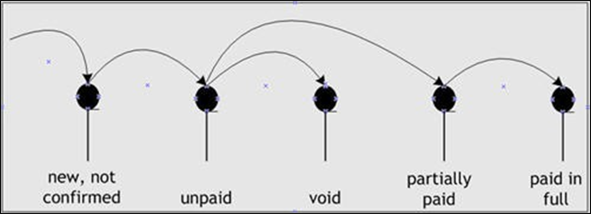

|  **Status**          |  **Meaning - Invoices**                                                                                                                                                                                                                                | **Meaning - Credit Memos**                                                           |
|----------------------|--------------------------------------------------------------------------------------------------------------------------------------------------------------------------------------------------------------------------------------------------------|--------------------------------------------------------------------------------------|
| New, not con- firmed | The invoice is not yet ready to send to the cus- tomer. | The credit memo is not yet ready to send to the customer.                            |
| Unpaid               | The invoice is approved, for payment but the cus- tomer has paid none of the amount.                                                                                                   | The customer has applied no portion of the credit memo to purchases.                 |
| Void                 | The unpaid invoice is void                                                                                                   | The unpaid credit memo is void.                                                      |
| Partially paid       | The customer has paid some, but not all, of the invoice.                                                                                                                                                                                               | The customer has applied some, but not all, of the credit memo to other pur- chases. |
| Paid in full         | The customer has paid the invoice in full.                                                                                                                                                                                                             | The customer has applied the entire credit memo to other purchases.                  |