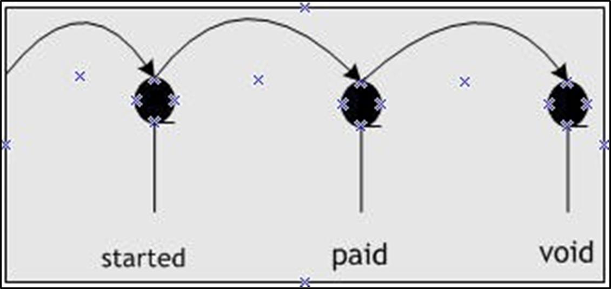

| **Status** | **Meaning**                                                                                                                                                                           |
|------------|---------------------------------------------------------------------------------------------------------------------------------------------------------------------------------------|
| Started    | The receipt, credit memo, or prepayment is not ready for you to apply to purchases.                                    |
| Paid       | You applied the receipt or credit memo to purchases, or approved, the prepayment for application to future purchases. |
| Void       | The receipt, credit memo, or prepayment is void. Made2Manage rolled it back from all purchases to which you applied it.   |