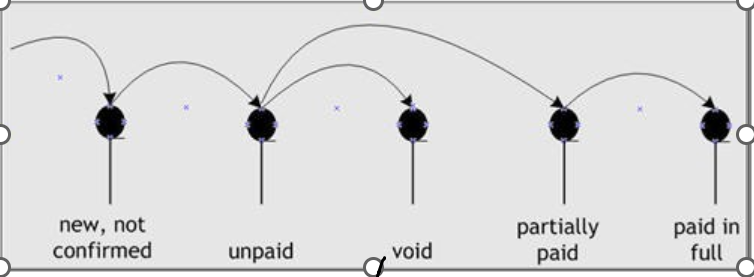
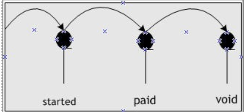

---

title: "Check invoiced sales tax"
draft: false
type: Article

---

Use the **Sales Tax** report to generate sales tax amounts on invoices by customer or by sales tax code.

By default, generic filters are available to generate this report. You can use **Advanced Filters** to cus- tomize or expand your filter criteria. For more information about **Advanced Filters**, click here.

To generate Sales Tax Report

1.  Open the **Sales Tax (Report) (RPSLTX)** page.

    Select **Financial Management** > **Financial Reports** > **Accounts Receivable** > **Sales Tax (Report)**.

Or

1.  *Search for* **RPSLTX** *in the* **Navigation box** *and then select* **Sales Tax (Report)**

    **Sales Tax (Report) (RPSLTX)** *page appears.*

2.  In the **Selection** list, select the information you want to view.
3.  In the **Sort Order** list, select how to sort the report.

    The **Sort On** field is populated based on the order selected in the **Sort Order** list.

4.  In the **Layout** list, select the layout in which you want to view the report.

    The **Layout** list is populated based on the type of report selected in the **Selec- tion** list.

5.  Select the **Summary** check box to show a high-level data report.
6.  In the **Date Range** area, type or select the date range for the report to be gen- erated. You can select the date from the **From** and **To** fields only if the **Custom** option is selected in the **Fill Dates** list.

    The **Date On** field is populated based on the type of report selected in the **Selec- tion** list.

    To include the entire time frame, leave the date fields blank.

    In the **Fill Dates** list, you can select from the predefined date ranges. They are:

    » **Custom**: Select this option to enable the **From** and **To** fields in the

    **Date Range** area.

    » **Calendar Year**: Select this option to display the **Calendar Year** list. You can select any of the predefined calendar year formats from the list.

    » **GL Periods**: Select this option to display the **GL Periods** list. You can select any of the predefined GL period formats from the list.

1.  In the **Sort Range** list, you can sort the information.

    The **Sort On** field is populated based on the type of report selected in the **Selec- tion** list.

    The available sort ranges are:

    » **Single**: Select this option to include only one item. Selecting this option enables the **From** field. Do one of the following:

    Type the item reference in the **From** field.

    Or

    Click the Lookup Reference and from the **Lookup For From** window, select the required sort item, and click **Select**.

    » **Range**: Select this option to include a range of items to sort from. Selecting this option enables the **From** and **To** fields. Do one of the following:

    Type the first and last values of the range in the **From** and **To** fields.

    Or

    Click the Lookup Reference (if available) and from the **Lookup For** window, select the required sort item, and click **Select**.

    » **All**: Select this to include all available items.

1.  On the **Toolbar**, click **Run Report** to generate the report.

    Select **Open now** to open the report in a new tab or select **Notify when Com- plete** to get notification. You can open the downloaded report from **My Reports** page.

**Accounts receivable invoice and credit memo statuses**

|Status|Meaning-Invoices|Meaning-Credit Card Memos|
|---|---|---|
|New, not confirmed|The invoice is not yet ready to send to the customer.|The credit memo is not yet ready to send to the customer.|
|Unpaid|The invoice is approved, for payment but the cus- tomer has paid none of the amount.|The customer has applied no portion of the credit memo to purchases.|
|Void|The unpaid invoice is void|The unpaid credit memo is void.|
|Partially paid|The customer has paid some, but not all, of the invoice.|The customer has applied some, but not all, of the credit memo to other purchases.|
|Paid in full|The customer has paid the invoice in full.|The customer has applied the entire credit memo to other purchases.|
|

**Accounts receivable receipt statuses** 

|Status|Meaning|
|---|---|
Started|The receipt, credit memo, or prepayment is not ready for you to apply to purchase.|
|Paid|You applied the receipt or credit memo to purchases, or approved, the prepayment for application to future purchases.|
|Void|The receipt, credit memo, or prepayment is void. Made2Manage rolled it back from all purchases to which you applied it.|
||

