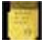

---  

title: "Activities & To Do Tasks"  
draft: false
type: Article

---

1.  You can access RMA in either of the following methods:  From the CRMCSR page

    Or

    From the RMA page

2.  On the **Toolbar**, click **More Actions**.
3.  Select **More Actions** > **Accessories** > **Activity**.
4.  If there are activities already associated, the **Activities** windows appears and displayed the activities.
5.  Click **New**.

    A blank **Activity** page opens.

    The **Entered By** field is Read-only.

6.  Type in a subject in the **Subject** field.
7.  Select the activity's type from the **Type** arrow.

    If the user has permission, click **Edit** at the end of the list. Here, the values can be added or edited.

8.  Set the due date and time for the activity in the **Due Date And Time** field.

    Or click the calendar icon to display the calendar and select desired date and time.

9.  Click the **Contact** lookup reference magnifying glass to open the **Lookup For Contact** window.
10. Highlight a row and click **Select**. Click **Cancel** to exit from this screen.

    Once the activity is saved and if the selected contact has an email address assigned, an **E-Mail** icon appears next to the name.

11. Click the **First Name** lookup reference magnifying glass to open the **Lookup For First Name** window.
12. Highlight a row and click **Select**. Click **Cancel** to exit from this screen.

    Once the activity is saved and if the contact selected has an email address, an **E- Mail** icon appears next to the name.

13. Type any notes of the activity in the **Description** box.
14. Click Save on the **Toolbar** to save the activity.

    The **Created Date** field will be filled in with the date and time the activity was saved. For new activities, the **Modified Date** field will update to show the last date and time the activity was modified, which in this case, is the same as the Created Date.

1.  Add an attachment, if desired. See "[Work with Attachment WebLinks](Attachments.md#working-with-attachments)".

## Change or Remove an activity

1.  Open the **Return Material Authorization(RMA)** page.
2.  Open the activity:

    The **Activity Detail** window can be accessed in several ways through **Accounts (CUST)**, **Customer Contacts,** **Quotes (QUOTE)**, **Sales Order (SO)**, **Opportunity Management (COPP)**, **Customer Service Inquiry (CRMCSR)**, **Return Material Authorization (RMA)**, and **Machine (MACHSER)**.
    
    1. On the Toolbar, click **More Actions**.
    1.  Select **More Actions** > **Accessories** > **Activity**. The **Activity** page appears.
2.  To change the activity:
    1.  Double click the row to select the RMA for which the activity is created.
    1.  Make the necessary changes.
    2.  Click Save on the **Toolbar** to keep any changes.
2.  To delete the activity:
    1.  Click **Delete** on the **Toolbar**.

        A message, *Preparing to delete this information. Are you sure?* is displayed.

    1.  Click **OK** to delete the activity.

        Or click **Cancel** to return to the **Activity** page and not delete the activity.

        The task is deleted.

| **Icon**                                          | **Type**   |
|---------------------------------------------------|------------|
|   | Phone Call |
|   | E-mail       |
|    | Conversation |
|   | Fax          |
|   | Letter       |
|   | Meeting      |
|    | Note         |
|   | To Do Item   |
|   | Other        |

# Modify the description of a task in the To Do list

You can modify and save the description of a task in the To Do list.

### To modify and save the description of a task in the To Do list

1.  Open the **To Do List (User) (TODO)** page.

##### Select Customer Relationship Management > CRM Trans- actions > To Do List (User).

*Or*

1.  *Search for* **TODO** *or* **To Do List (User)** *in the* **Navigation box** *and then select* **To Do List (User)***.*

    **To Do List (User) (TODO)** *page appears.*

2.  Make the necessary changes.
3.  On the **Toolbar**, click **Save** to keep the activity and the changes made to the description.

    Close **All**, **Refresh**, **Cancel**, **Apply Filter**, and **Clear Filter** are enabled.

### To launch the respective activities

1.  Open the **To Do List (User) (TODO)** page.

##### Select Customer Relationship Management > CRM Trans- actions > To Do List (User).

*Or*

1.  *Search for* **TODO** *or* **To Do List (User)** *in the* **Navigation box** *and then select* **To Do List (User)***.*

    **To Do List (User) (TODO)** *page appears.*

2.  Click on Account **No.** to display the page for which the Activity is associated.
3.  Click on a **Subject** to display the page with the respective Activity.

# Filter To Do Tasks

Within the **To Do** page, you can filter the tasks to show only those within a certain date range or by customer. This is useful if you have a lot of open tasks and only want to see certain tasks.

## To Filter To Do Tasks by Date Range

1.  Click **Date** arrow and select **Custom** from the drop-down list.
2.  Specify the **start date** for the filter:
1.  Click the **From Date** calendar icon. A **Calendar** appears.
    1.  Use the window and its controls to select the start date for the filter. The selected date appears in the **From Date** field.
2.  Specify the **end date** for the filter:
1.  Click the **To Date** calendar icon. A **Calendar** appears.
    1.  Use the window and its controls to select the desired end date for the filter.

        The selected date appears in the **To Date** field.

2.  Click **Apply Filter**.

    The **To Do List** page shows only the tasks that fall between the dates specified. If there are no tasks within that date range, the **To Do List** page will be empty.

3.  Click **Clear** to clear the filter and show all the **To Do** tasks.

## To Filter To Do Tasks by Customer

1.  Select the customer to filter by from the **Customer** lookup reference.

    Only customers that have Activities created against them will appear in the drop- down.

2.  Select the required row and click **Select**. Or, double-click the required row to select it.
3.  Click **Apply Filter** to filter the tasks by that customer.

    The **To Do List** page shows only the tasks for that customer.

1.  Click **Clear** to clear the filter and show all the To Do tasks.

# Complete a To Do Task

## To close a single activity

1.  Open the **Return Material Authorization(RMA)** page.
2.  On the **Toolbar**, click **More Actions**.
3.  Select **More Actions** > **Accessories** > **Activity**.
4.  In the grid, double-click the required activity.
5.  Select the **Mark as Completed** check box.
6.  On the **Toolbar**, click **Save**.

    The activity is completed and moves from the **Open** tab to the **Completed** tab.

## To close all the activities

1.  Open the **Return Material Authorization(RMA)** page.
2.  On the **Toolbar**, click **More Actions**.
3.  Select **More Actions** > **Accessories** > **Activity**.

    2. Select the check boxes for all the activities irrespective of the status of the activity and click **Save** on the **Toolbar**.

    All the open activities are shifted to the **Completed** Tab
