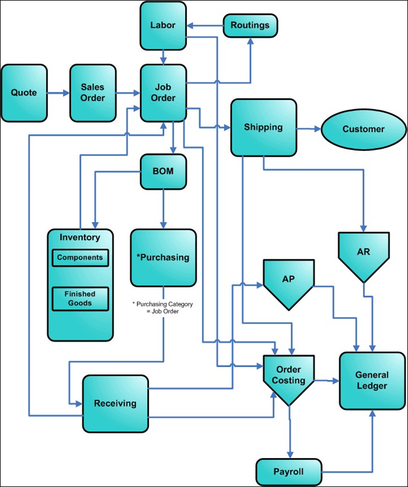

---

title: "Make-to-Order (MTO)"
draft: false
type: Article

---

An MTO A shop that manufactures custom products that customers order. The product could be standard and custom items combined to meet the customer's special needs, or could be the manufacture of all-custom parts and assemblies from the customer's design. 

Shop, also called a job shop (Also called contract manufacturer, make-to-order) A shop that manufactures custom products that customers order. The product could be standard and custom items combined to meet the customer's special needs or could be the manufacture of all-custom parts and assemblies from the customer's design.

A contract manufacturer (Also called make-to-order, job shop) A shop that manufactures custom products that customers order. The product could be standard and custom items combined to meet the customer's special needs, or could be the manufacture of all-custom parts and assemblies from the customer's design., a custom manufacturer, manufactures custom products that customers order. The final product could be standard and custom items combined to meet the customer Someone who agrees to buy goods from your special needs, or could be the manufacture of all-custom parts and assemblies from the customer's design. 

An MTO (make-to-order, Also called contract manufacturer, job shop) A shop that manufactures custom products that customers order. The product could be standard and custom items combined to meet the customer's special needs, or could be the manufacture of all-custom parts and assemblies from the customer's design environment generally does not make or order the same parts and assemblies in more than one job. Because of the one-off nature of an MTO shop's work, the company generally cannot use past production history to predict future costs, order statuses, or quality.

Workflow in an MTO shop begins with a sales order. The sales order (SO) A record of information needed to authorize and process a customer's order. The sales order lists all items to be sold to the customer leads to a job order that specifies the work to do. After the shop produces the items, the Shipping department ships them.

​