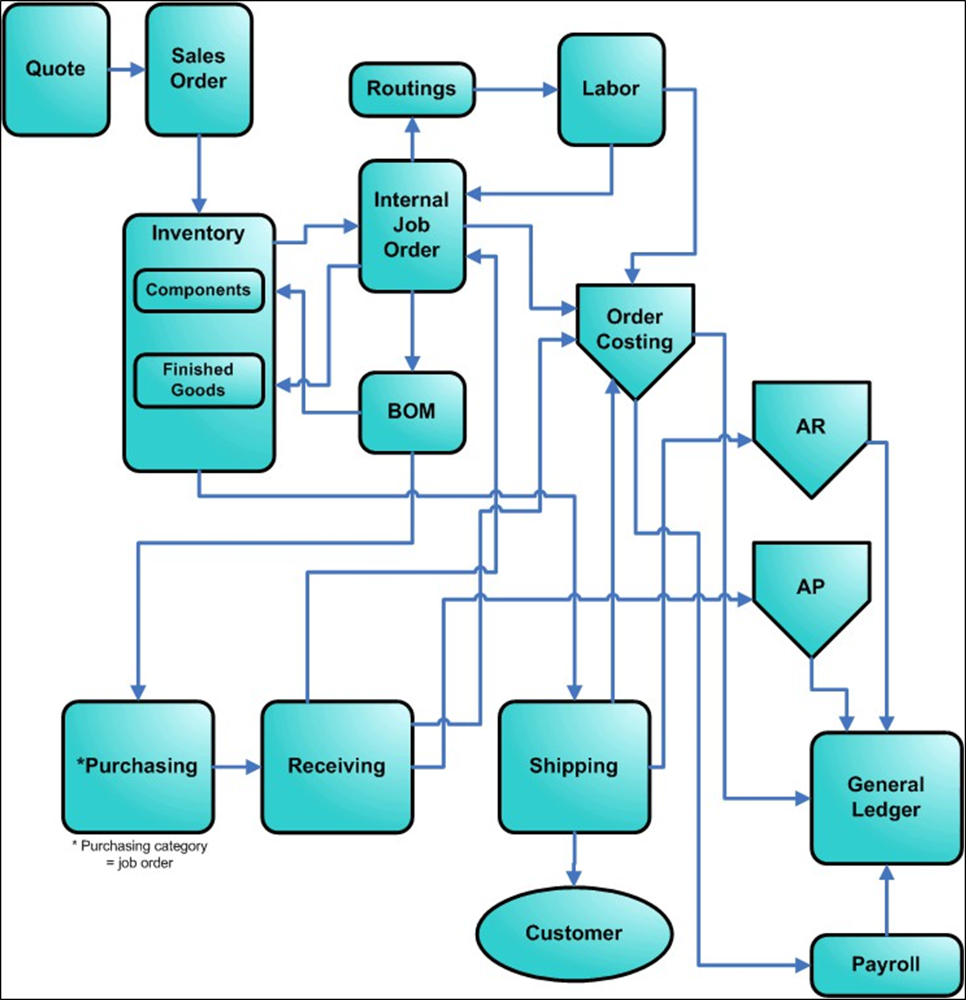

---

title: "Make-to-Stock (MTS)"
draft: false
type: Article

---

An MTS shop makes products and places them in inventory. They ship products from inventory when customers order them. Depending upon the products' complexity, MTS shops can benefit from creating a MPS to set and keep commitments, for lowest cost. They can also keep job histories to help them predict costs, production times, and quality.

Workflow in an MTS shop begins with a job order that specifies the work to do. After the shop produces the products, the products become part of inventory. When a sales order arrives, the Shipping department ships the items from inventory.

Some MTS shops are repetitive environments, making very large quantities of identical products without job orders. Made2Manage is most effective in discrete MTS shops, which use job orders.

​