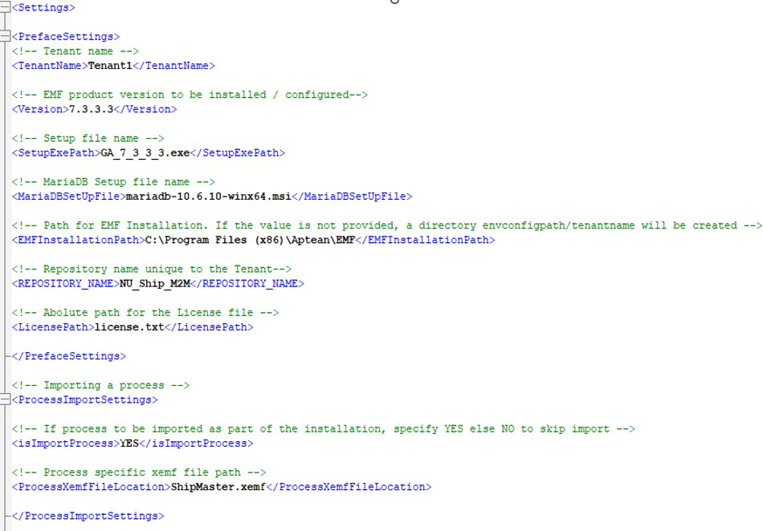

# M2M-Ship Installation and Integration

This section provides details on the installation and configuration of the Aptean Ship integration. The image below illustrates the M2M - Ship integration flow.

## Prerequisites

Before proceeding with the installation, it is important to fulfill the following prerequisites:

**For M2M**:

-   Set up the Ship API configurations.
-   Execute the APISHIP setup within the M2M company to configure the APIs.
-   Validate the setup on the API configuration screen, where a record containing the Ship client ID will be generated.
-   Ensure the grant type is set to resource owner only.
-   Obtain valid credentials for M2M.

**For Ship**:

-   Acquire the Ship Tenant code.
-   Set up the Ship tenant details using the acquired Ship tenant code.
-   Configure the Ship API settings.
-   Initiate the APISHIP setup within the M2M company to establish API connections.
-   Verify the setup by checking the API configuration screen; a record containing the Ship client ID should be generated.
-   Ensure that the grant type is set to *resource owner only*.
-   Obtain valid credentials specifically for M2M integration.

**For Smart Hub**:

-   Update all the aforementioned configurations within the configuration ship file.
-   Ensure the provided details in the configurations are valid.
-   Essential authentication and API access details include DB Name, Client ID, Client Secret, Scope, and Tenant.

**For AIP**:

-   Obtain a dedicated Tenant ID for both M2M and Ship, particularly for V1.
-   Incorporate these tenants into their respective fields within the NU config file and the Ship portal.

## Installation Instructions for Ship Integration

This section provides the steps for installing the Ship integration within Smart Hub.

>[!NOTE]
>The installation process will be managed by the Aptean Support team.

To set up Smart Hub for the integration, perform the following:

1.  Download and extract the installation package.
    1.  Download the certified version of the package zip file (NU_Ship_Made2Manage_8.0_ 2024xxxx.x.zip) from the [M2M-Ship Integration SharePoint](https://apteanonline.sharepoint.com/teams/NoUpgradeIntegration/Shared%20Documents/Forms/AllItems.aspx?id=%2Fteams%2FNoUpgradeIntegration%2FShared%20Documents%2FIntegration%20with%20M2M%2FInstall%20Packages%2FNU%20Ship%2FM2M%208%2E0%20v1%2E1%2E0%2FNU%5FShip%5FMade2Manage%5FM2M8%2E0%5F20240201%2E1%2Ezip&parent=%2Fteams%2FNoUpgradeIntegration%2FShared%20Documents%2FIntegration%20with%20M2M%2FInstall%20Packages%2FNU%20Ship%2FM2M%208%2E0%20v1%2E1%2E0&p=true&ct=1713944741648&or=Teams%2DHL&ga=1) location.
    2.  Unzip the file and copy all the contents to C:LiteIntegration as shown below:

        

2.  Open the ConfigSettings.xml file located in C:LiteIntegration using a text editor, and update it for Smart Hub installation and configurations. This file is used to set the parameters required to install Smart Hub.

    >[!NOTE]
    >You require administrator rights to update the ConfigSettings.xml file.

    -   Update the installation path and Repository name. Update <EMFInstallationPath> with the value where EMF is installed in the VM.

        

        For more details, refer to the [ConfigSettings.xml](#configsettingsxml) section.

3.  Open the ConfigShip.xml file located in C:LiteIntegration using a text editor, and update the ConfigShip.xml file.
    1.  Change ConfigShip.xml for the integration process configurations.
    2.  Update M2M API configuration and Ship API configuration information under the <Main> loop.

        

    3. Update AIP configs with M2M and Ship tenant information, which can be obtained from the DevOps or Dev team.
            
        For more details, refer to the [ConfigShip.xml](#configshipxml) section.

4.  Configure New Company. To add a new company, create a new tenant with a unique name (Example: DB002). The <tenant> body must be copied and pasted below </Tenant>.
5.  If EMF or MariaDB already exists in the environment (if the Ship integration solution has been executed previously), perform the following:
    1.  Remove the Smart Hub Repository database.
    2.  Uninstall MariaDB.
    3.  Stop the Smart Hub server from services and uninstall the Smart Hub application.
6.  Run Setup.bat:
    1.  Open the command prompt in Administrator mode and navigate to the C:LiteIntegration folder.
    2.  Run the Setup.bat file; it should perform the following:
        -   Install MariaDB 10.6.10.
        -   Install Smart Hub application (v733).
        -   Create a repository with the name specified in ConfigSettings.xml.
        -   Install Smart Hub license.
        -   Import the Master package into the repository and run the Installer process.
        -   Create processes and services based on the tenant details specified in ConfigShip.xml.
        -   Run the ConfigureDatabase process, setting up all configurations according to the details specified in ConfigShip.xml.
        -   After successful completion, sensitive information will be masked, and file names will be changed (e.g., ConfigSettings.xml converts to ConfigSettings_ masked.xml, ConfigShip.xml converts to ConfigShip_masked.xml).
7.  To set up another company, change the file names:
    1.  Rename the ConfigShip_masked.xml file to ConfigShip.xml and provide values for specific fields instead of masked text:
        1.  /Settings/Main/M2MConfigs/password
        2.  /Settings/Main/ShipConfigs/clientSecret
    2.  Rename the ConfigSettings_masked.xml file to ConfigSettings.xml and provide values for specific fields instead of masked text:
        i. /Settings/DatabaseSettings/adminPassword
    3.  Add new company configurations in the ConfigShip.xml file.
    4.  Run the Installer process to create tenant-specific processes and services.
    5.  After the successful installation of the added company, sensitive information will be masked, and file names will be changed (e.g., ConfigSettings.xml converts to ConfigSettings_masked.xml, ConfigShip.xml converts to ConfigShip_masked.xml).

## For Existing Environment Setup with NU Already Installed (Manual Import)

Follow the steps below to set up an existing environment with NU already installed:

1.  Download and copy the latest file to **C:LiteIntegration**.
2.  Update the **datasourceconfigship.csv** file for configuring the database and process schedule settings.
3.  Open **Smart Hub** and log in to repositories.
4.  Right-click on the **Root Folder**, select the **Import** option from the context menu, and choose the NU Ship xemf file from the location in the first step. Complete the import. This action should create a ShipIntegration folder and processes.
5.  Expand the **ShipIntegration** folder, go to the ConfigureDatabase process, then right-click and select the **Run Now** option from the context menu. This action should initiate the configuration of the Ship integration.
6.  Exit **Smart Hub**.
  
    >[!NOTE]
    >If you are updating an existing NU Ship solution, remove the older version by deleting the Shipping Integration folder in the Smart Hub repository.

## For Existing Environment Setup (if no upgrade integration solution has already run once)

Follow the steps below to set up an existing environment with NU already installed:

1.  Drop the Smart Hub repository database.
2.  Uninstall MariaDB.
3.  Stop the Smart Hub server from services and uninstall the Smart Hub application.
4.  Drop the AI_CONFIGSHIP table from the database.
5.  Download and copy the latest file at C:LiteIntegration.
6.  Change the ConfigSetting.xml for Smart Hub installation and configurations.
7.  Change ConfigSetting.xml for DB and process schedule configurations.
8.  Run Setup.bat.

## Configurations in ConfigSettings and ConfigShip

This section provides the configuration settings and parameters available in the ConfigSettings.xml and ConfigShip.xml files.

### ConfigSettings.xml

This topic provides the configuration settings to be done in the ConfigSettings.xml file.

Use the ConfigSettings.xml file to define parameters necessary for the installation of Smart Hub, repository creation, license installation, and process importing. Be sure to adjust key entries as per the installation.

**EMFInstallationPath**: Specify the installation path for the Smart Hub application.

### ConfigShip.xml

This topic provides details on the parameters available in the ConfigShip.xml file.

#### Main (Common for All Tenants or Companies)

##### M2MConfigs

The following table provides the default values and their descriptions for the parameters available in M2MConfigs.

| **Parameter** | **Default Values Or Examples**    | **Description**                                                                          |
|---------------|-----------------------------------|------------------------------------------------------------------------------------------|
|  baseURI      |  https://prod.m2m.apteancloud.com | This is the base URI to make any request through the API of M2M.                         |
|   username    |                                   | This is a required parameter for authentication to make request through the API for M2M. |
| password      |                                   | Required to authenticate the user.                                                       |
| clientID      |                                   | Required for API authentication.                                                         |
| clientSecret  |                                   | Required for API authentication.                                                         |

##### ShipConfigs

The following table provides the default values and their descriptions for the parameters available in ShipConfigs.

| **Parameter**              | **Default Values Or Examples**       | **Description**                                                                   |
|----------------------------|--------------------------------------|-----------------------------------------------------------------------------------|
|   baseURI                  |   https://prod.ship.apteancloud.com/ | This is the base URI to make any request through the API of Ship.                 |
|  ClientID                  |                                      | This is required to acquire tokens for authentication.                            |
|  clientSecret              |                                      | This is required to acquire tokens for authentication.                            |
|  Scope                     |                                      | This is required to acquire tokens for authentication.                            |
|  Audience                  |                                      | This is required to acquire tokens for authentication.                            |
|   taskManagement_ baseUri |                                      | This is the base URI to make any request through the API of Ship Task management. |
|   taskManagement_ scope   |                                      | This is required to acquire tokens for task management API authentication.        |

##### AIPconfig

The following table provides the default values and their descriptions for the parameters available in AIPconfig.

| **Parameter** | **Default Values Or Examples**                      | **Description**                                                  |
|---------------|-----------------------------------------------------|------------------------------------------------------------------|
|  baseURI      | https://integration- graph.apteansharedservices.com | This is the base URI to make any request through the API of AIP. |

#### Tenants (Specific to Tenant or Company)

##### DataSourceConfig

Within the ConfigShip.xml file, update the highlighted fields in the DataSourceConfig section to establish connections with the M2M company database. Additionally, customize the upload and download schedule according to your requirements. It is advised to allocate 59 minutes for Sales Order upload and 30 minutes for Shipment download.

The following table provides the default values and their descriptions for the parameters available in DataSourceConfigs.

|  **Parameter** | **Default Values Or Examples** |  **Description**                   |
|----------------|--------------------------------|------------------------------------|
| DB Type        | M2MDB                          | Type of database                   |
| DB Username    | SA                             | Username for database access       |
| DB Password    | ABC-123                        | Password for database access       |
| Server Name    |                                | Name of the server (if applicable) |
| Database Name  | M2MDATA                        | Name of the M2M database           |

| **Parameter** |                **Default Values**                       |     **Description**                                               |
|--------------------------------------------------------------|------------|----------------------------------------------|
| Port Number                                                  | 1433       | Port number for database connection          |
| Upload Start Date                                            | 2024-01-01 | Start date for scheduled uploads             |
| Upload End Date                                              | 2100-01-01 | End date for scheduled uploads               |
| Upload Start Time                                            | 00:00:00   | Start time for scheduled uploads             |
| Download Start Date                                          | 2024-01-01 | Start date for scheduled downloads           |
| Download End Date                                            | 2100-01-01 | End date for scheduled downloads             |
| Download Start Time                                          | 00:00:00   | Start time for scheduled downloads           |
| Download Repeat Interval                                     |  30        | Interval (in minutes) for repeated downloads |
|  Upload Repeat Interval                                      |   59       | Interval (in minutes) for repeated uploads   |

##### ProcessConfigs

Amend the highlighted fields in the ProcessConfigShip.csv file with your specific configurations. It is advisable to ensure consistency between {ApteanShip-Company} and {M2M-CompanyDB} configurations mentioned previously. For the Production environment, eliminate 'stg.' from the URL.

The following table provides the default values and their descriptions for the parameters available in ProcessConfig.

| **Parameter** | **Default Values Or Examples**     | **Description**                             |
|---------------|------------------------------------|---------------------------------------------|
|  M2M-baseURL  |  https://prod.m2m.apteancloud.com/ | Base URI for M2M API requests               |
|  M2M-UserName |                                    | Required para- meter for API authentication |
|  M2M-Password |                                    | Required for API authen- tication           |

| **Parameter** |                **Default Values**                       |     **Description**                                               |
|------------------------------------------------------|--------------------------------------------------------------------------------------|------------------------------------------------------------------------------|
|  M2M-ClientID                                        |                                                                                      | Required for API authen- tication                                            |
|  M2M-ClientISecret                                   |                                                                                      | Required for API authen- tication                                            |
|  M2M-Scope                                           |  M2MAPI                                                                              | Required for API authen- tication                                            |
|  M2M-TenantID                                        |  2023R1                                                                              | Required for API authen- tication                                            |
|  M2M-CompanyID                                       |  01                                                                                  | Required for API authen- tication                                            |
|   si-aip-baseUrl                                     |   https://integration-graph.aptean- sharedservices.com/v1                            | Base URL for AIP API (For Production: Use alternate URL)                     |
|   si-aip-eventCon- sumerWebhookUrl                   |   https://integration-con- sumer.apteansharedservices.com/v1/webhook/ {AIP-TenantId} | Event con- sumer web- hook URL for AIP (For Pro- duction: Use alternate URL) |
|  si-aip-contactEmail                                 |                                                                                      | Customer Email ID                                                            |
| si-tenantId                                          |                                                                                      | AIP Tenant ID                                                                |
|  si-tenantKey                                        |                                                                                      | AIP Tenant Key                                                               |

| **Parameter** |                **Default Values**                       |     **Description**                                               |
|------------------------------------------------------|---------------------------------------|----------------------------------------------------|
|  si-m2m-productId                                    |  446ebd6c-b3c1-4b81-906f-b6dfe72b637e | M2M Product ID                                     |
| si-m2m-version                                       | 8.0                                   | M2M version                                        |
|  si-m2m-systemDb                                     |  M2MSystem                            | M2M System Database Name                           |
|   si-m2m-shipDateFilter                              |   2024-01-01                          | Date from which ship- ments need to be fetched     |
|  si-apteanship-tenantCode                            |  m2mqa                                | Tenant code provided by Aptean Ship                |
|  si-apteanship-locationCode                          |  Default                              | Location code provided by Aptean Ship              |
|  si-apteanship-com- panyName                         |   NU-Ship                             | Company name provided by Aptean Ship               |
|  si-apteanship-productId                             |  d6e08344-697c-4c26-8822-52842cda808e | Aptean Ship Product ID                             |
|  si-apteanship-eventPro- ducerTenantId               |                                       | Event pro- ducer tenant ID provided by Aptean Ship |
|  si-apteanship-sourceId                              |  512                                  | Source ID provided by Aptean Ship                  |

##### M2MConfigs

The following table provides the default values and their descriptions for the parameters available in M2MConfigs.

|  **Parameter** | **Default Values Or Examples** |  **Description**                                                      |
|----------------|--------------------------------|-----------------------------------------------------------------------|
|  CompanyID     |  01                            | It is required to fetch or create data to respective company in M2M.  |
|  Facility      |  DEFAULT                       | It is required to fetch or create data to respective facility in M2M. |

##### ShipConfigs

The following table provides the default values and their descriptions for the parameters available in ShipConfigs.

|  **Parameter** | **Default Values** |  **Description**                                          |
|----------------|--------------------|-----------------------------------------------------------|
| companyID      | Ship CST           | Refers to Ship company.                                   |
| plantCode      | 003                | This is required in every API request body.               |
|  databaseName  |                    | This specifies which database operations need to perform. |

##### AIPConfigs

###### Ship

The following table provides the default values and their descriptions for the AIPConfigs parameters available in Ship.

|  **Parameter**    | **Default Values** |  **Description**                                                                    |
|-------------------|--------------------|-------------------------------------------------------------------------------------|
| x-aptean- tenant  |                    | It refers to the tenant ID required for authentication to make an API call to AIP.  |
| x-aptean- apim    |                    |  Required for authentication to make API call to AIP.                               |
| x-aptean- product |                    | It refers to the product ID for Ship, which is required to make an API call to AIP. |

###### M2M

The following table provides the default values and their descriptions for the AIPConfigs parameters available in M2M.

|  **Parameter**    | **Default Values** |  **Description**                                                                   |
|-------------------|--------------------|------------------------------------------------------------------------------------|
| x-aptean- tenant  |                    | It refers to the tenant ID required for authentication to make an API call to AIP. |
| x-aptean- apim    |                    |  Required for authentication to make API call to AIP.                              |
| x-aptean- product |                    | It refers to the product ID for M2M, which is required to make an API call to AIP. |

#### Sample Formats

Customize the configurations for different companies by updating their respective company names and locations in the tenants' section to ensure accurate settings for each company.

Sample format for single company:

Sample format for multi-company:

## Setting Up SMTP Server

This section provides details on setting up the SMTP server, which is required to send emails to the recipients for error notifications.

>[!NOTE]
> If an SMTP service already exists for other integrations, you still need to set up this service for Ship integration.

To set up the SMTP server, perform the following:

1.  Open the **Smart Hub** repository, navigate to **Services**, and then select **SMTP Services**.

    

2.  Open **MySmtpService**. It should resemble the image below:

    

3.  Configure the following details:
    -   **From**: Name of the Sender.
    -   **From address**: Email address of the sender.
    -   **Email server**:
        -   **For Gmail**: smtp.gmail.com
        -   **For Outlook**: smtp.office365.com
    -   **Username**: Username for the sender's mail account.
    -   **Password**: If two-factor authentication is enabled, provide the application key. Otherwise, provide the email account password.
4.  Click **Apply** and then **OK**.

## Field Validations

When synchronization occurs from Aptean Ship to M2M, ensure that the following fields are filled in:

-   No. of Boxes
-   Freight Charges
-   Tracking Number
-   Shipment Weight
-   Shipping Via (this entry should be present in both M2M and Aptean Ship)

## Use Cases

### Use Case 1: Setting Up Company Name

Ensure that your company name is properly configured in Aptean Ship after installation or configuration.

### Use Case 2: Syncing Source Fields

Make sure that information like Ship Via synchronizes correctly after setup. Only active Ship Vias are synced. You can view the Ship Via map using the 'carrier - service' filter in Aptean Ship. Key Ship Via details from M2M will appear in the Value Translations field.

### Use Case 3: Creating a New Shipping Record

When creating a new Shipping record, ensure all necessary details are included. Afterward, upload the record to Aptean Ship for processing.

You'll find the uploaded document listed under your company name.

### Use Case 4: Editing Shipping Records

If you need to make changes to a Shipping record, simply edit it and upload the updated document to Aptean Ship. The system will ensure the changes are accurately reflected.

### Use Case 5: Completing Shipping Processes

After creating a Shipping record, complete the process by creating a Shipment.

Populate all necessary details from the uploaded document, including Ship Via and shipping rates.

Once completed, the system will handle the rest, including updates to M2M fields.

Additionally:

-   Ensure the agent picks up the Shipment on the next scheduled pick-up.
-   Users will see shipping fields populated from Aptean Ship, including Ship Weight, Number of Boxes, Freight Charge, and Tracking Number.
-   Dependency on the M2M Processor Service is eliminated; instead, Smart Hub will update M2M fields directly.
-   If Custom Write-Back setup is configured, Ship Via changes from Aptean Ship should reflect in M2M.

    
