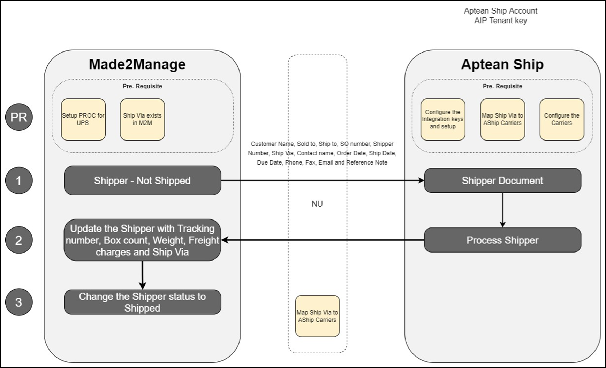

# M2M 8.0 - Ship Setup and Configuration

## Overview

This section describes the data flow between M2M and Aptean Ship as well as the prerequisites required for integration.

## Prerequisites

This section lists the setup and configuration requirements for M2M-Ship Integration.

### Pre-requisites in Made2Manage

-   The shipper must have at least one item added to it.
-   The quantity of the item in the shipper must be greater than zero (0).
-   Set up the Ship API configurations.
-   Execute the **APISHIP** setup within the M2M company to configure the APIs.
-   Validate the setup on the **API configuration** screen. A record containing the **Ship Client ID** will be generated.
-   Ensure the grant type is set to resource owner only.
-   Obtain valid credentials for M2M.

## Aptean Ship Currency Support

Aptean Ship supports transactions in either **USD** or **CAD**, depending on the the country specified during the company setup.

## Conditions to Consider

Following are the conditions to consider for integration:

-   **Source Document**: M2M Shipping record serves as the source document for Aptean Ship. A Shipping record is uploaded to Aptean Ship only under specific conditions:
    -   Status must be Not Shipped (SHMAST.fconfirm = 'N').
    -   Type must either be SO, MI, VE, JO, or DO (SHMAST.ftype IN ('SO','MI','VE','JO','DO')).
    -   Ship quantity must be greater than zero (SHITEM.fshipqty > 0).
-   **Editing Records**: Editing an uploaded document in M2M triggers an update to the corresponding record in Aptean Ship. However, synchronization occurs only until the status is changed to Shipped in M2M. Changes to master/parent records like Customer/Sales Order do not trigger updates.
-   **Write-Back**: Write-back from Aptean Ship tracks only active Shipments and  void Shipments are ignored.

## Custom Write-Back Setup

Utilize Custom Write-Back Setup in Aptean Ship to map Ship Carrier Service to M2M Ship Via. If you are using multiple companies, create a separate source interface for each company.
