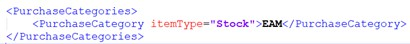
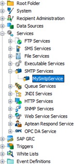

# M2M-EAM Installation and Configuration

This section provides details on the installation and configuration of the Aptean EAM integration.

## Pre-requisites

Before proceeding with the installation, it is important to fulfill the following prerequisites:

**For M2M**:

-   Execute the APIEAM setup within the M2M company to configure the API.
-   Provide the information entered in the APIEAM setup for authentication in Smart Hub.

>[!NOTE]
>Mandatorily use the Grant Type as Resource Owner in the API Aptean EAM Setup.

**For EAM**:

-   DB Name, Client ID, Client Secret, Scope, Audience, Task Management Scope, and Plant Code are necessary for authentication and API access.
-   Ensure that Crossroads API and Task Management API are both enabled.

**For AIP**:

-   Obtain a dedicated Tenant ID for both M2M and EAM.
-   Register both M2M and EAM as producers.
-   Visit this link to create the producer in AIP [Swagger UI](https://integration-graph.apteansharedservices.com/swagger/index.html).

**For Smart Hub**:

-   Ensure Smart Hub version 7.3.3 (Recommended).
-   MariaDB version must be 10.6.

**For Multi-Company**:

-   Acquire a new EAM plant code for mapping to each facility in M2M.
-   Obtain a new Company ID for mapping to each company in M2M.
-   Create a new Tenant ID for both M2M and EAM in AIP.

## Installation Instructions for EAM Integration

This section provides the steps for installing the EAM integration within Smart Hub.

>[!NOTE]
>The installation process will be managed by the Aptean Support team.

To set up Smart Hub for the integration, perform the following:

1.  Download and extract the installation package.
    1.  Download the certified version of the package zip file (NU_EAM_M2M8.0\_ 20231123.2.zip) from the M2M-EAM Integration SharePoint location.
    2.  Unzip the file and copy all the contents to C:\\LiteIntegration as shown below:

        

2.  Open the ConfigSettings.xml file located in C:\\LiteIntegration using a text editor, and update it for Smart Hub installation and configurations. This file is used to set the parameters required to install Smart Hub.

    >[!NOTE]
    >You require administrator rights to update the ConfigSettings.xml file.

    -   Update the installation path and Repository name. Update \<EMFInstallationPath> with the value where EMF is installed in the VM.

        

    For more details, refer to the [ConfigSettings.xml](#configsettingsxml) section.

3.  Open the EAM_Config.xml file located in C:\\LiteIntegration using a text editor, and update the EAM_Config.xml file.
   
    >[!NOTE]
    >You require administrator rights to update the EAM_Config.xml file.

    1.  Change EAM_Config.xml for the integration process configurations.
    2.  Match {EAM-Company} to {M2M-CompanyDB}, and {EAM-plant} to {M2M-facility}.
    3.  Add Vendor Types, Purchase Category under \<DataSourceConfig>.

        

    4.  Update M2M API configuration and EAM API configuration information under the \<Main> loop.

        

    5.  Update AIP configs with M2M and EAM tenant information, which can be obtained from the DevOps or Dev team.

        

For more details, refer to the [EAM_config.xml](#eam_configxml) section.

4.  Configure New Company. To add a new company, create a new tenant with a unique name (Example: DB002). The \<tenant> body must be copied and pasted below \</Tenant>.

    

5.  If EMF or MariaDB already exists in the environment (if the EAM integration solution has been executed previously), perform the following:
    1.  Remove the Smart Hub Repository database.
    2.  Uninstall MariaDB.
    3.  Stop the Smart Hub server from services and uninstall the Smart Hub application.
6.  Run Setup.bat:
    1.  Open the command prompt in Administrator mode and navigate to the C:\\LiteIntegration folder.
    2.  Run the Setup.bat file; it should perform the following:
        -   Install MariaDB 10.6.10.
        -   Install Smart Hub application (v733).
        -   Create a repository with the name specified in ConfigSettings.xml.
        -   Install Smart Hub license.
        -   Import the Master package into the repository and run the Installer process.
        -   Create processes and services based on the tenant details specified in EAM\_ config.xml.

            

            >[!TIP]
            >In the provided example, configuration is done for two tenants. For the 1st tenant, the plant code is CST, and the facility is DEFAULT. For the 2nd tenant, the plant code is BM2, and the facility is EAMTEST. In the above example, two sets of processes will be created: one for Plant CST and the other for BM2.

        -   Run the Configure Database process, setting up all configurations according to the details specified in EAM_config.xml.
        -   After successful completion, sensitive information will be masked, and file names will be changed (e.g., ConfigSettings.xml converts to ConfigSettings_ masked.xml, EAM_config.xml converts to EAM_config_masked.xml).
7.  To set up another company, change the file names:
    1.  Rename the EAM_config_masked.xml file to EAM_config.xml and provide values for specific fields instead of masked text:
        1.  /Settings/Main/M2MConfigs/password
        2.  /Settings/Main/EAMConfigs/clientSecret
    2.  Rename the ConfigSettings_masked.xml file to ConfigSettings.xml and provide values for specific fields instead of masked text:

        1. /Settings/DatabaseSettings/adminPassword

    3.  Add new company configurations in the EAM_config.xml file.
    4.  Run the Installer process to create tenant-specific processes and services.
    5.  After the successful installation of the added company, sensitive information will be masked, and file names will be changed (e.g., ConfigSettings.xml converts to ConfigSettings_masked.xml, EAM_config.xml converts to EAM_config_masked.xml).

## For Existing Environment Setup with NU Already Installed (Manual Import)

Follow the steps below to set up an existing environment with NU already installed:

1.  Download and copy the latest file to C:\\LiteIntegration.
2.  Change the file name of EAM_config_masked.xml to EAM_config.xml.
3.  Update the settings in the EAM_config.xml file.
4.  Open Smart Hub and log in to repositories.
5.  Right-click on the Root Folder, select the Import option from the context menu, and choose the NU EAM xemf file from the location in the first step. Complete the import. This action should create an EAMIntegration folder and processes.
6.  Modify the following fields in the JDBC connection settings of the repository after exporting:
    -   Username: Set up while creating the repository.
    -   Password: Created for the above username to log in to the DB.
    -   Database Name: The repository name will be used.
7.  Expand the EAMIntegration folder, go to the ConfigureDatabase process, then right-click and select the Run Now option from the context menu. This action should initiate the configuration of the EAM integration.
8.  Exit Smart Hub.

## Configurations in ConfigSettings and EAM_Config

This section provides the configuration settings and parameters available in the ConfigSettings.xml and EAM_Config.xml files.

### ConfigSettings.xml

This topic provides the configuration settings to be done in the ConfigSettings.xml file.

Use the ConfigSettings.xml file to define parameters necessary for the installation of Smart Hub, repository creation, license installation, and process importing. Be sure to adjust key entries as per the installation.

**EMFInstallationPath**: Specify the installation path for the Smart Hub application.

### EAM_config.xml

This topic provides details on the parameters available in the EAM_config.xml file.

#### Main (Common for All Tenants or Companies)

##### M2MConfigs

The following table provides the default values and their descriptions for the parameters available in M2MConfigs.

| **Parameter** | **Default Values Or Examples**                     | **Description**                                                                          |
|---------------|----------------------------------------------------|------------------------------------------------------------------------------------------|
|  baseURI      | URI for M2M 8.0 - https://prod.m2m.apteancloud.com | This is the base URI to make any request through the API of M2M.                         |
|   username    |                                                    | This is a required parameter for authentication to make request through the API for M2M. |
| password      |                                                    | Required to authenticate the user.                                                       |
| clientID      |                                                    | Required for API authentication.                                                         |
| clientSecret  |                                                    | Required for API authentication.                                                         |

##### EAMConfigs

The following table provides the default values and their descriptions for the parameters available in EAMConfigs.

| **Parameter**              | **Default Values Or Examples**      | **Description**                                                                  |
|----------------------------|-------------------------------------|----------------------------------------------------------------------------------|
|   baseURI                  |   https://prod.eam.apteancloud.com/ | This is the base URI to make any request through the API of EAM.                 |
|  ClientID                  |                                     | This is required to acquire tokens for authentication.                           |
|  clientSecret              |                                     | This is required to acquire tokens for authentication.                           |
|  Scope                     |                                     | This is required to acquire tokens for authentication.                           |
|  Audience                  |                                     | This is required to acquire tokens for authentication.                           |
|   taskManagement_ baseUri |                                     | This is the base URI to make any request through the API of EAM Task management. |
|   taskManagement_ scope   |                                     | This is required to acquire tokens for task management API authentication.       |

##### AIPconfig

The following table provides the default values and their descriptions for the parameters available in AIPconfig.

| **Parameter** | **Default Values Or Examples**                                                                                  | **Description**                                                    |
|---------------|-----------------------------------------------------------------------------------------------------------------|--------------------------------------------------------------------|
|    baseURI    | For e.g. https://stg.integration- graph.apteansharedservices.com For Production, env stg will not be available. |   This is the base URI to make any request through the API of AIP. |

#### Tenants (Specific to Tenant or Company)

##### DataSourceConfigs

The following table provides the default values and their descriptions for the parameters available in DataSourceConfigs.

|  **Parameter**          | **Default Values**        |  **Description**                                                                                         |
|-------------------------|---------------------------|----------------------------------------------------------------------------------------------------------|
|   supplierStartDate     | 2023-04-21 or YYYY-MM- DD | Start date to poll vendors from M2M. Use the similar date format as specified in the default value.      |
|   supplierEndDate       | 2100-10-10 or YYYY-MM- DD |   End date to poll vendors from M2M.                                                                     |
|  supplierStartTime      | 00:00:00 or HH:MM:SS      |  Start time to poll vendors from M2M.                                                                    |
|  supplierRepeatInterval |  30                       | Duration of time (in minutes) to repeat polling vendors from M2M.                                        |
|   reqStartDate          | 2023-04-21 or YYYY-MM- DD | Start date to poll Requisitions from EAM. Use the similar date format as specified in the default value. |
|   reqEndDate            | 2100-10-10 or YYYY-MM- DD |   End date to poll Requisitions from EAM.                                                                |
|  reqStartTime           | 00:00:00 or HH:MM:SS      |  Start time to poll Requisitions from EAM.                                                               |

|  **Parameter**          | **Default Values**        |  **Description**                                                                                         |
|-------------------------|---------------------------|----------------------------------------------------------------------------------------------------------|
|  reqRepeatInterval                               |  30                       | Duration of time (in minutes) to repeat polling Requisitions from EAM.                                                                                            |
|   POStartDate                                    | 2023-04-22 or YYYY-MM- DD |   Start date to poll Purchase orders from M2M.                                                                                                                    |
|   POEndDate                                      | 2100-10-10 or YYYY-MM- DD |   End date to poll Purchase orders from M2M.                                                                                                                      |
|    POStartTime                                   |   00:00:00 or HH:MM: SS   | Start time to poll Purchase orders from M2M. POStartTime should be earlier than receiptStartTime since receipts should be created after creating purchase orders. |
|  PORepeatInterval                                |  45                       | Duration of time (in minutes) to repeat polling Purchase orders from M2M.                                                                                         |
|   receiptStartDate                               | 2023-04-22 or YYYY-MM- DD |   Start date to poll receipts from M2M.                                                                                                                           |
|   receiptEndDate                                 | 2100-10-10 or YYYY-MM- DD |   End date to poll receipts from M2M.                                                                                                                             |
|  receiptStartTime                                | 00:00:00 or HH:MM: SS     | Start time to poll receipts from M2M. receiptStartTime should be after POStartTime.                                                                               |

|  **Parameter**          | **Default Values**        |  **Description**                                                                                         |
|-------------------------|---------------------------|----------------------------------------------------------------------------------------------------------|
|  receiptRepeatInterval                           |  45 | Duration of time (in minutes) to repeat polling receipts from M2M. |

##### M2MConfigs

The following table provides the default values and their descriptions for the parameters available in M2MConfigs.

|  **Parameter**          | **Default Values Or Examples**        |  **Description**                                                                                         |
|-------------------------|---------------------------|----------------------------------------------------------------------------------------------------------|
|  CompanyID           |  01                            | It is required to fetch or create data to respective company in M2M.                                                                                                                                                                                                                                                                 |
|  Facility            |  DEFAULT                       | It is required to fetch or create data to respective facility in M2M.                                                                                                                                                                                                                                                                |
|          VendorTypes |        ST                      | Vendors will be fetched from M2M with the provided vendor types. Multiple vendor types can be provided.  Example: Single Vendor type – ST vendor type can be  configured. 

Multiple - AP and ST vendor types can be configured. |

|  **Parameter**          | **Default Values Or Examples**        |  **Description**                                                                                         |
|-------------------------|---------------------------|----------------------------------------------------------------------------------------------------------|
|               PurchaseCategories |               EAM              | Item type of EAM should be mapped with Purchase category in M2M. In Requisition to PO flow, the POs will be created M2M with purchase category that is mapped with respective Item type of line item from EAM. Multiple mappings can be provided. Example:  Single mapping – Stock Item type is mapped to EAM purchase category .    Multiple mapping –  

Service Item type is mapped to EAM1 purchase category. |

##### EAMConfigs

The following table provides the default values and their descriptions for the parameters available in EAMConfigs.

|  **Parameter** | **Default Values** |  **Description**                                          |
|----------------|--------------------|-----------------------------------------------------------|
| companyID      | EAM CST            | Refers to EAM company.                                    |
| plantCode      | 003                | This is required in every API request body.               |
|  databaseName  |                    | This specifies which database operations need to perform. |

##### AIPConfigs

###### EAM

The following table provides the default values and their descriptions for the AIPConfigs parameters available in EAM.

|  **Parameter**    | **Default Values** |  **Description**                                                                   |
|-------------------|--------------------|------------------------------------------------------------------------------------|
| x-aptean- tenant  |                    | It refers to the tenant ID required for authentication to make an API call to AIP. |
| x-aptean- apim    |                    |  Required for authentication to make API call to AIP.                              |
| x-aptean- product |                    | It refers to the product ID for EAM, which is required to make an API call to AIP. |

###### M2M

The following table provides the default values and their descriptions for the AIPConfigs parameters available in M2M.

|  **Parameter**    | **Default Values** |  **Description**                                                                   |
|-------------------|--------------------|------------------------------------------------------------------------------------|
| x-aptean- tenant  |                    | It refers to the tenant ID required for authentication to make an API call to AIP. |
| x-aptean- apim    |                    |  Required for authentication to make API call to AIP.                              |
| x-aptean- product |                    | It refers to the product ID for M2M, which is required to make an API call to AIP. |

## Setting Up SMTP Server

This section provides details on setting up the SMTP server, which is required to send emails to the recipients for error notifications.

>[!NOTE]
>If an SMTP service already exists for other integrations, you still need to set up this service for EAM integration.

To set up the SMTP server, perform the following:

1.  Open the Smart Hub repository, navigate to **Services**, and then select **SMTP Services**.

    

2.  Open **MySmtpService**. It should resemble the image below:

    

3.  Configure the following details:
    -   **From**: Name of he Sender.
    -   **From address**: Email address of the sender.
    -   **Email server**:
        -   **For Gmail**: smtp.gmail.com.
        -   **For Outlook**: smtp.office365.com.
    -   **Username**: Username for the sender's mail account.
    -   **Password**: If two-factor authentication is enabled, provide the application key. Otherwise, provide the email account password.
4.  Click **Apply** and then **OK**.

## Integration Flow

The M2M - EAM integration flow is shown in the image below.

## Field Validations

Ensure synchronization of validation codes for the following fields between M2M and EAM:

-   The Vendor Type in M2M should match the Supplier Type in EAM.
-   The Currency Code in M2M should match the Currency Code in EAM.
-   The Shipping Method in M2M should match the Freight Code in EAM.
-   The Vendor Payment Terms Code in M2M should match the Supplier Terms Code in EAM.
-   The Planner Code in M2M should match the Buyer Code in EAM.
-   The Unit of Measure Codes in M2M should match the Unit of Measure Codes in EAM.
-   Location and Bin codes in M2M should match the Location and Bin codes in EAM.

    >[!NOTE]
    >The integration will encounter an error unless the codes that require mapping between EAM and M2M are in the same case, as the codes are case-sensitive. Additionally, the system mandates entering all master fields in uppercase for accurate data processing.

## Field Mappings

This section provides details and descriptions for the fields available in EAM and M2M.

### Supplier Integration

#### Supplier Header

The following table details the fields available in EAM and M2M for Supplier Header.

| **Field In M2M** | **Field In EAM** |  **Description**                                                                                                     |
|------------------|------------------|----------------------------------------------------------------------------------------------------------------------|
| Vendor No        | Supplier         | The value received from M2M will be exactly updated to EAM.                                                          |
| Company          | Name             | The value received from M2M will be exactly updated to EAM.                                                          |
| City             | City             | The value received from M2M will be exactly updated to EAM.                                                          |
| State            | State            | The value received from M2M will be exactly updated to EAM.                                                          |
| Zip              | Postal Code      | The value received from M2M will be exactly updated to EAM.                                                          |
| Country          | Country          | The value received from M2M will be exactly updated to EAM.                                                          |
| Phone            | Phone            | The value received from M2M will be exactly updated to EAM.                                                          |
| Fax              | Fax              | The value received from M2M will be exactly updated to EAM.                                                          |
|  E-Mail          | Email address    |  The value received from M2M will be exactly updated to EAM.                                                         |
| Shipping Method  |  Freight         | The Freight code is validated along the codes present in EAM, so it will only accept the codes present in EAM.       |
| Payment Terms    | Payment Terms    | The Payment terms code is validated along the codes present in EAM, so it will only accept the codes present in EAM. |

| **Field In M2M** | **Field In EAM** |  **Description**                                                                                                     |
|------------------|------------------|----------------------------------------------------------------------------------------------------------------------|
| Vendor Type                                       | PO Details- Type | Type is validated along the codes present in EAM, so it will only accept the codes present in EAM.                                                                                          |
| Default Currency                                  |  Currency        | The Currency code is validated along the codes present in EAM, so it will only accept the codes present in EAM.                                                                             |
| Credit Limit                                      | Credit Limit     | The value received from M2M will be exactly updated to EAM.                                                                                                                                 |
|  Vendor Status                                    |   Active         | If the Status in M2M is ‘Approved’ then supplier will be active in EAM. If ‘Inactive’ then supplier will be inactive in EAM. If ‘Started’ then supplier won’t be picked by the integration. |

#### Vendor Address

The following table details the fields available in EAM and M2M for Vendor Address.

| **Field In M2M** | **Field In EAM** |  **Description**                                                                                             |
|------------------|------------------|--------------------------------------------------------------------------------------------------------------|
|  Key             | Address Code     |  The value received from M2M will be exactly updated to EAM.                                                 |
|  Address         |  Address         | The value received from M2M will be exactly updated to EAM. Only first 255 characters can be updated to EAM. |

#### Vendor Contacts

The following table details the fields available in EAM and M2M for Vendor Contacts.

|  **Field In M2M** | **Field In EAM** |  **Description**                                                                                             |
|-------------------|------------------|--------------------------------------------------------------------------------------------------------------|
| First Name        |  Contact Name    |  First Name and Last Name from M2M will be concatenated and updates to EAM.                                  |
| Last Name         |                  |                                                                                                              |
|  Category/Title   |  Title           | The value received from M2M will be exactly updated to EAM.                                                  |
|  Phone            | Work Phone       | The value received from M2M will be exactly updated to EAM.                                                  |
|  Fax              |  Fax             | The value received from M2M will be exactly updated to EAM.                                                  |
|  E-Mail           |  Email           | The value received from M2M will be exactly updated to EAM.                                                  |
|  Notes            |  Notes           | The value received from M2M will be exactly updated to EAM. Only first 255 characters can be updated to EAM. |
|  Primary Contact  | Primary Contact  | If Primary Contact status in M2M will be updated exactly to EAM.                                             |

### Requistion to PO

#### Purchase Order Header

The following table details the fields available in EAM and M2M for Purchase Order Header.

|  **Field In EAM**    | **Field In M2M** |  **Description**                                                                                                                                                                                |
|----------------------|------------------|-------------------------------------------------------------------------------------------------------------------------------------------------------------------------------------------------|
|    Buyer             |    Planner       | The value received from EAM will be exactly updated to M2M. The Buyer code received from EAM will be validated along the codes present in M2M, so it will only accept the codes present in M2M. |
| Recommended Supplier | Vendor Number    | The value received from EAM will be exactly updated to M2M.                                                                                                                                     |
|  Delivery Date       | Promised Date    | The value received from EAM will be exactly updated to M2M.                                                                                                                                     |

#### Items

The following table details the fields available in EAM and M2M for Items.

|  **Field In EAM**            | **Field In M2M**       |  **Description**                                                                                              |
|------------------------------|------------------------|---------------------------------------------------------------------------------------------------------------|
|  Units                       | Unit of Measure        | Unit of measure is validated along the codes present in M2M, so it will only accept the codes present in M2M. |
|  Date required from Supplier | Original promised date |  The value received from EAM will be exactly updated to M2M.                                                  |
|  Qty Issued                  | Received Quantity      | The value received from EAM will be exactly updated to M2M.                                                   |

| **Field In EAM** | **Field In M2M** |  **Description**                                                                                                     |
|------------------|------------------|----------------------------------------------------------------------------------------------------------------------|
|  Unit Cost                                     |  Unit Cost     | The value received from EAM will be exactly updated to M2M. |
|  Item                                          | Part Number    | The value received from EAM will be exactly updated to M2M. |
|  Qty required                                  | Order Quantity | The value received from EAM will be exactly updated to M2M. |

### Purchase Order Integration

The following table details the fields available in EAM and M2M for Purchase Order Integration.

| **Field In M2M** |  **Field In EAM** |  **Description**                                            |
|------------------|--------------------|-------------------------------------------------------------|
| Part Number      |  Item              | The value received from M2M will be exactly updated to EAM. |
| Order Quantity   |  Qty Ordered       | The value received from M2M will be exactly updated to EAM. |
|  Unit Cost       |  Unit Cost         | The value received from M2M will be exactly updated to EAM. |
| Address Key      |  Area              | The value received from M2M will be exactly updated to EAM. |
| Vendor Number    |  Supplier          | The value received from M2M will be exactly updated to EAM. |

| **Field In M2M** | **Field In EAM** |  **Description**                                                                                                     |
|------------------|------------------|----------------------------------------------------------------------------------------------------------------------|
| Vendor Part Number                                 | Manufacturer Part Number | The value received from M2M will be exactly updated to EAM.                                                              |
| Unit of measure                                    | Unit of Purchase         | Unit of measure is validated along the codes present in EAM, so it will only accept the codes present in EAM.            |
| PO Number                                          | Purchase Order           |   The value received from M2M will be exactly updated to EAM.                                                            |
| Purchase Order Revision                            |   Release                |                                                                                                                          |
| Item Number                                        |  PO Line                 | The value received from M2M will be exactly updated to EAM.                                                              |
|   Location                                         |   Stores Location        | The value received from M2M will be exactly updated to EAM. Location code in M2M should match with location code in EAM. |
|   Bin                                              |   Bin                    | The value received from M2M will be exactly updated to EAM. Bin code in M2M should match with Bin code in EAM.           |

### Receipt Integration

The following table details the fields available in EAM and M2M for Receipt Integration.

| **Field In M2M**        | **Field In EAM**       |  **Description**                                                                                                         |
|-------------------------|------------------------|--------------------------------------------------------------------------------------------------------------------------|
| Part Number             |  Item                  |  The value received from M2M will be exactly updated to EAM.                                                             |
| Quantity Received       | Qty Received           |  The value received from M2M will be exactly updated to EAM.                                                             |
| Unit Cost               | Unit Cost              | The value received from M2M will be exactly updated to EAM.                                                              |
| Vendor Number           |  Supplier              |  The value received from M2M will be exactly updated to EAM.                                                             |
| Inventory U/M           | Unit of Purchase       | Unit of measure is validated along the codes present in EAM, so it will only accept the codes present in EAM.            |
| Purchase Order Revision | Purchase Order Release |   The value received from M2M will be exactly updated to EAM.                                                            |
| Item Number             |  PO Line               |  The value received from M2M will be exactly updated to EAM.                                                             |
|   Location              |  Stores Location       | The value received from M2M will be exactly updated to EAM. Location code in M2M should match with location code in EAM. |
|  Bin                    |  Bin                   | The value received from M2M will be exactly updated to EAM. Bin code in M2M should match with Bin code in EAM.           |

## Error Notification

In the event of any errors during integration, notifications will be sent to recipients subscribed to the M2MIntegrationAdmin job function in EAM.

## Known Issues

1.  If any updates are made to a Purchase Order (PO) in M2M that has already been synced to EAM, a change order will be created in EAM. Note that the update is not specific to changes in order quantity.
2.  Receipts for Blanket POs cannot be created in EAM. An error notification will be sent, indicating that the PO does not exist if an attempt is made to create it.
3.  Once contact details of a vendor in M2M are synced to EAM, modifying the contact's first name or last name will add a new contact to the vendor in EAM.
4.  The supplier address value will not be pulled into the PO record in EAM which is created from M2M.

## Points to Note

1.  If a vendor is deleted in M2M, manual deletion is required in EAM.
2.  Active vendors in M2M will be transferred to EAM. If a vendor is made inactive in M2M and is synced in EAM, the integration will update the vendor's status as inactive in EAM.
3.  While creating a Requisition to PO, if an item is standard, the revision and unit cost will be updated from the Item Master in M2M. If nonstandard, it will be considered as NS, and the unit cost will be updated as in EAM.
4.  Avoid using special characters (', ", /, +) when creating records in M2M.
5.  Field length limitations for the following fields when creating items in the Requisition of EAM:
    -   Item – max length (25)
    -   Qty Received – 15 (including decimal)
    -   Qty Returned – 15 (including decimal)
    -   Unit cost – 17 (including decimal)
    -   Qty Ordered – 15 (including decimal)

    If data provided exceeds the specified length, the PO will not be created in M2M and will send an error notification.

6.  When importing suppliers to EAM, the Ship Method field from M2M is linked to the Freight field in EAM. If the Ship Method information is not available in M2M, the vendor can still be synchronized, but the Freight field in EAM must be filled in manually, as it is a required field.
7.  While creating a Requisition in EAM, Purchasing interface should be enabled in Module availability.
8.  Please note the following while making any changes for PO or creating a Receiver in M2M:
    1.  Text length in Location should not exceed 5; otherwise, it will be truncated to 5 in EAM.
    2.  Text length in Unit cost should not exceed 10 (including decimal); otherwise, it won't import to EAM and throws an error notification.
    3.  Text length for Quantity Ordered/Received (including decimal) should not exceed 10; otherwise, it won't import to EAM and throws an error notification.
9.  Steps to set up Over Receipts in EAM:
    1.  Go to Setup in EAM Navigation bar.
    2.  Select Setup Options in the Drop-down.
    3.  Go to Inventory Options and select General.
    4.  Click on DETAILS in the right-side panel.
    5.  Edit and select the required option under Over Receipts.
    6.  Select an option:
        -   **Do Not Allow Quantity on Hand to Fall Below Zero** – Throws an error if over- received.
        -   **Allow Quantity on Hand to Fall Below Zero; No Warning** – Allows over- receiving.
        -   **Allow Quantity on Hand to Fall Below Zero; Provide a Warning** – Provides a warning if over-received.

        Refer to the image below for better understanding:

        

## Test Scenario - Supplier Integration

1.  Create a vendor in M2M, filling in all the necessary fields. Change the vendor status to Approved, and configure the vendor type to match your setup configuration for synchronization. Map the fields mentioned in the Field Mapping to EAM.
2.  The Supplier Integration process will run according to the scheduled time specified in the configuration. During execution, the integration will pick up this vendor and update it in EAM.
3.  The supplier will be created in EAM as depicted in the image below:

    

## Test Scenario - Requisition to PO

1.  Create a requisition in EAM with the required items and approve it.
2.  Execute the Requisition Integration process based on the scheduled time specified in the configuration. During execution, the system will retrieve the created requisitions and generate purchase orders in the M2M system. Subsequently, an acknowledgment is sent to EAM to confirm the successful creation of the purchase order. Any errors occurring during this process will be communicated within the acknowledgment.
3.  Purchase orders will be created per vendor. For example, if a requisition has three line items, where the first two have one vendor and the third another vendor, then two purchase orders will be created in M2M: the first with two items and the second with one.
4.  Purchase orders will be created in M2M as depicted in the image below:

    

## Test Scenario - Purchase Order Integration

1.  Make the necessary changes for the purchase order created in M2M and update the status to Open.
2.  Execute the Purchase Integration process based on the scheduled time specified in the configuration. During execution, the system will retrieve the purchase order and create it in EAM. If any changes are made to the purchase order after syncing to EAM, a change order will be generated in EAM.
3.  Purchase orders will be created in EAM as shown in the image below:

    

## Test Scenario - Receipt Integration

1.  Create a receiver for the PO created from the EAM requisition in M2M and change the status to Received.
2.  Execute the Receipt Integration process based on the scheduled time specified in the configuration. During execution, the system will retrieve the receipts from M2M and create them in EAM.
3.  Purchase receipts will be created as shown in the image below:

    
