# M2M-EAM Setup and Configuration

The M2M-EAM Integration allows the requisition of items and services required for asset maintenance within EAM. These requisitions automatically convert into purchase orders in M2M. The diagram below visually explains the flow of information: vendors designated by specific vendor types will be added to EAM as suppliers, available for selection on requisitions.

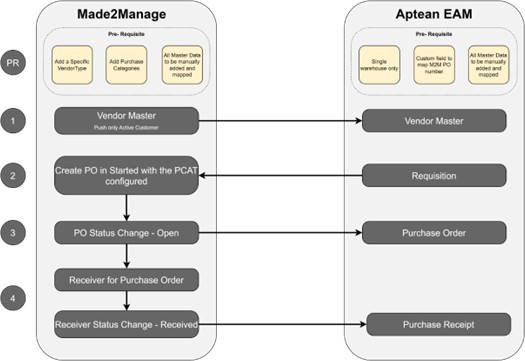

Once the purchase order status is set to open in M2M, a corresponding purchase order will be created in EAM for reference. This enables EAM users to track their ordered items and expected delivery dates. Upon receiving the purchase order with its status changed in M2M, a corresponding receiver will be generated in EAM, indicating the availability of the items.

All invoicing and expense tracking are handled in M2M, based on the expense account on the designated purchase category. Made2Manage serves as the primary system of record for vendors, purchase orders, and receivers.

# Pre-requisites

This section outlines the prerequisites for the setup and configurations required for M2M-EAM Integration.

## Pre-requisites in Made2Manage

1.  **Vendor Type**: Create and assign Vendor Types to synchronize desired vendors with EAM. Refer to M2M help topics for assistance in creating vendor types.
2.  **Vendor Status**: Ensure that the selected Vendor status is set to **Approved**.
3.  **Purchase Category**: PCAT should be created in M2M and configured as part of the configuration file. Refer to M2M help topics for assistance in creating Purchasing Categories (PCAT).
4.  **APIEAM Setup**: Ensure the API EAM Setup has been executed within the M2M company that is integrated with EAM.
    
    >[!NOTE]
    >This is a setup that is normally executed during implementation.

## Pre-requisites in EAM

1.  Mapping store locations to M2M locations:
    -   Each plant within EAM should have one or more store locations defined.
    -   The store locations must be appropriately mapped to corresponding locations in the Made2Manage system.
2.  Create or import the following items into EAM using standard tools, ensuring alignment with the information contained in M2M:
    -   Unit of Measure
    -   Payment Terms
3.  Ensure the creation of a Ship Via entry that aligns with the Supplier's designated Freight Method in EAM.

    >[!NOTE]
    >Refer to [Appendix](#appendix) for the location and screenshots of the codes, which must match.

# Synchronizing Data from M2M to EAM

Ensure that the vendors you intend to synchronize with EAM have all the necessary fields filled out as per EAM requirements.

>[!IMPORTANT]
>Enter the modified date while configuring the integration.

Confirm that these vendors are assigned the appropriate vendor types for synchronization and that they are currently in an *Approved* status.

>[!NOTE]
>The integration will encounter an error unless the codes that require mapping between EAM and M2M are in the same case, as the codes are case-sensitive. Additionally, the system mandates entering all master fields in uppercase for accurate data processing.

To synchronize data from M2M to EAM:

1.  Navigate to the Vendor screen.
2.  Search or Browse to the first Vendor record you will be synchronizing to EAM and select it.
3.  Verify on the Vendor that you have the following populated as they are required in EAM:
    -   Phone Number
    -   Payment Terms
    -   Currency
    -   Shipping Method
    -   Vendor Type
4.  Ensure there is a contact associated with the vendor through the linked contacts.
5.  Ensure the vendor is in *Approved* status.
6.  Repeat these steps for all of the vendors you will be synchronizing to EAM.

## Verify EAM Supplier Synchronization

Ensure that vendors are updated as suppliers in EAM.

## Purchase Order Flow from M2M to EAM

When a requisition is processed in EAM then a purchase order is automatically created in M2M. Changing the status of the PO to Open will trigger the creation of a PO in EAM for reference. Edits to the PO in M2M will process as change orders to the referenced PO in EAM.

>[!NOTE]
>Verify that purchase order number sequence used in M2M will not cause duplicate PO numbers in EAM. If duplicate PO numbers are found this will result in errors in the integration.

## Receiver Flow from M2M to EAM

When a purchase order associated with an EAM requisition is received in M2M per normal processes, the status change of that receiver to Received will trigger the event to update EAM. This will create the receiver in EAM at the scheduled interval to provide visibility within EAM that the items have been received and are available to use.

>[!NOTE]
>Please refer to either the M2M or EAM standard documentation and help files for how to create or edit vendors, purchase orders, receivers, and requisitions.

# Appendix

This section provides additional information and resources for further reference M2M-EAM setup and configuration.

## Appendix: Code Creation

>[!NOTE]
>Integration is case-sensitive; thus, various codes shown in the guide must be set up in EAM with the exact same case as they are in M2M. For all M2M codes, the Stored Value is the key used by the integration to find the matching EAM code.

>[!NOTE]
>Before enabling the integration, ensure that the Purchasing
Interface module in EAM is turned off. Once disabled, create all the corresponding codes listed below. After adding the codes, turn on the Purchasing Interface module in EAM to initiate integration with M2M.

### Vendor Types

To view the Vendor Type in M2M, navigate to **Vendors** > **Additional Info** > **Vendor Type** > **Dropdown** > **Edit** > **Popup Table Maintenance**.

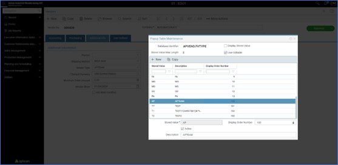

To view the Supplier Type in EAM, navigate to **Setup** > **Validation Codes** > **Supplier Type** > Select the header > **Details** > **New**.

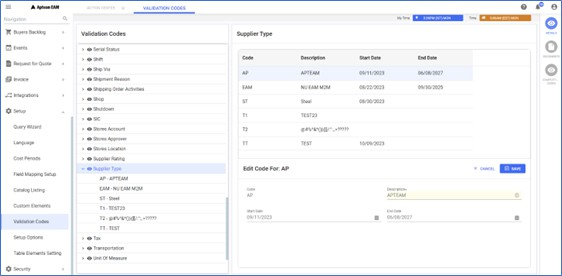

### Currency Codes

To view the Currency Code in M2M:

Navigate to **Vendors** > **Additional Info** > **Default Currency – Click on the Default Currency label**.

Or

**Utilities** > **Company Setup** > **System** > **Country/Currency Formats**.

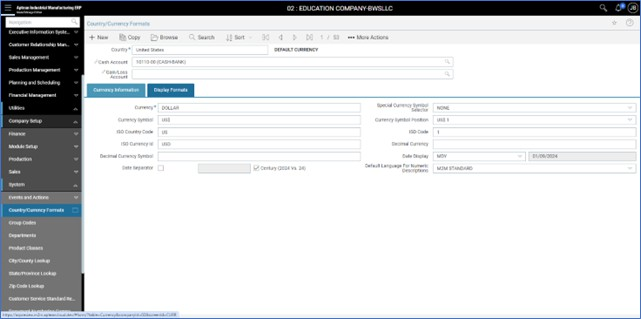

To view the Currency Code in EAM, navigate to **Setup** > **Validation Codes** > **Currency** > Select the header > **Details** > **New**.

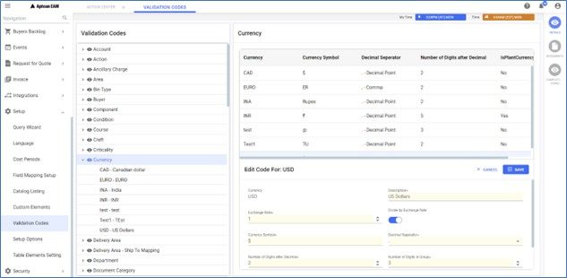

### Shipping Methods

To view the Shipping Method in M2M, navigate to **Vendors** > **Additional info** > **Shipping Method** > **Dropdown** > **Edit** > **Popup Table Maintenance**.

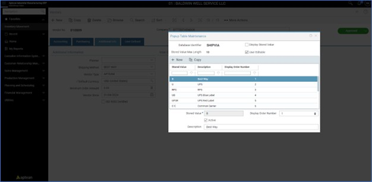

To view the Freight Code in EAM, navigate to **Setup** > **Validation Codes** > **Freight** > Select the header > **Details** > **New**.

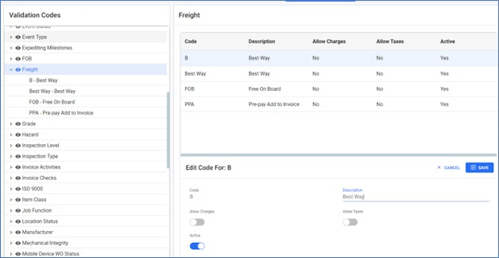

### Payment Terms

To view the Vendor Payment Terms in M2M:

Navigate to **Vendors** > **Accounting** > **Payment Terms** – Click the Payment Terms label to open the Vendor Terms.

Or

**Utilities** > **Company Setup** > **Vendor Payment Terms**.

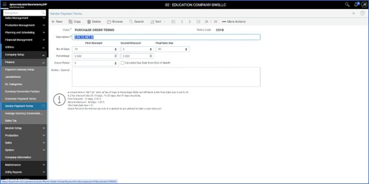

To view the Payment Terms in EAM, navigate to **Setup** > **Validation Codes** > **Payment Terms** > Select the header > **Details** > **New**.

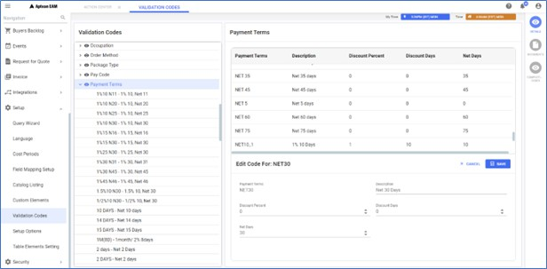

### Buyer Codes

To view the Buyer Code in M2M, navigate to **Purchase Orders** > **New** > **Planner** > **Dropdown** > **Edit** > **Popup Table Maintenance**.

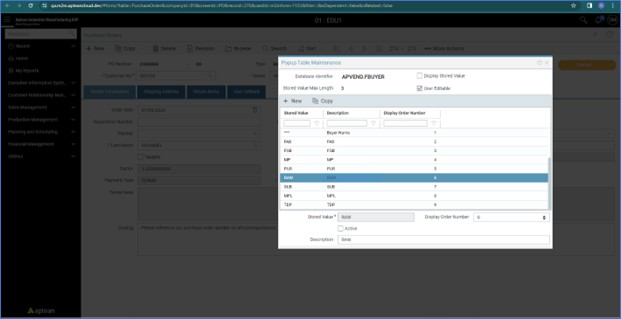

To view the Buyer Code in EAM, navigate to **Setup** > **Validation Codes** > **Buyer** > Select the header > **Details** > **New**.

### Unit of Measure

To view the Unit of Measure in M2M:

Navigate to **Purchase Orders** > **Items** > **Part Number** > **Master** > **Inventory U/M** > **Dropdown** > **Edit** > **Popup Table Maintenance**.

Or

Any M2M page with an item and the unit of measure field accessible > **Dropdown** > **Edit** > **Popup Table Maintenance**.

To view the Unit of Measure in EAM, navigate to **Setup** > **Validation Codes** > **Unit of Measure** > Select the header > **Details** > **New**.

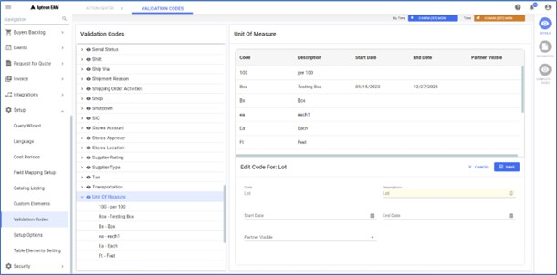

### APIEAM Setup in M2M

To view the API Aptean EAM Setup in M2M, navigate to **Utilities** > **Company Setup** > **Module Setup** > **M2M WEB API** > **API Aptean EAM Setup**.

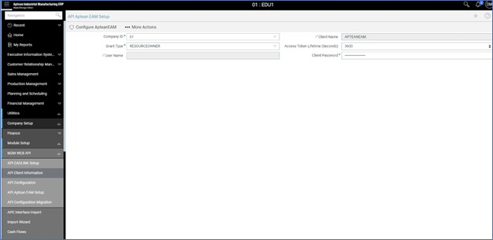

## Appendix: Troubleshooting

#### Why is my vendor not synchronizing to EAM as a Supplier?

-  Check if the Vendor Status in M2M is Approved, as only approved vendors will synchronize to EAM.
-  Ensure that the phone number is populated in the main vendor information, as it is mandatory in EAM for the Supplier.
-  Verify that the Vendor Type selected in M2M matches the type designated in the integration configuration for identifying vendors to synchronize to EAM.
-  Ensure that the Vendor Type in M2M matches the Supplier Type in EAM, including case sensitivity.
-  Check if the Currency Code used in M2M for vendors exists in EAM.
-  Verify that the Shipping Method code in M2M exists in EAM as Freight codes.
-  Ensure that the Payment Terms code in M2M exists in EAM.

#### Why is my requisition not creating a PO in M2M?

-  Requisitions must be in an Approved status before being converted to a Purchase Order in M2M.
-  Check if the Buyer code in EAM matches the stored value in M2M Popup Table Maintenance for the Buyer/Planner.
-  Verify that the Unit of Measure used in EAM exists in M2M.

#### Why is my item number coming in as a non-standard item on the PO in M2M?

If the Item codes in EAM do not match exactly to the Item Master record in M2M, the item will be added to the Purchase Order as a non-standard item.

#### Why is the Purchase Order not showing in EAM?

Verify the status of the Purchase Order in M2M, as only PO’s in Open status will trigger the creation of the corresponding PO in EAM.

#### Why is the Receipt not showing in EAM?

Check the status of the Receiver in M2M, as only Receivers in Received status will trigger the creation of the corresponding Receipt in EAM.

#### What should I do if there's a mistake in the API endpoint configuration?

-  Rerun the APEAM Setup to accurately configure all endpoints.
-  Double-check the processes for any references to APIs.

#### What should I do when the token expires?

-  Tokens remain active for 60 minutes, but in NU, they are regenerated every 10 minutes when expired.
-  This error can be avoided if the token is created during installation.

#### Why am I receiving email notification errors for custom added Item Types not mapped in the Configuration file with a Purchasing Category in M2M?

Custom added Item Types to EAM that are not mapped in the Configuration file with a Purchasing Category in M2M will result in email notification errors indicating that they are not mapped. In Phase 2 of the integration, a configuration will be introduced to identify Item Types to be ignored. Meanwhile, there are two approaches to address this:

-  **Configure Item Type**: This involves configuring the missing item type in the configuration file of NU. While this is the preferred solution, it requires assistance from SRE for configuration.
-  **Cancel Requisition**: Alternatively, requisitions with unconfigured Item Types can be canceled in EAM, allowing for the use of mapped Item Types on subsequent requisitions.