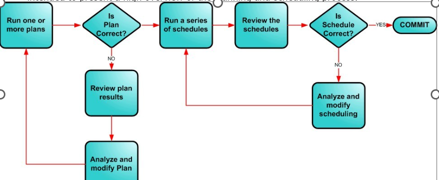

---

title: "Understanding What-If and Production modes"
draft: false
type: Article

---

M2M Planning and Scheduling has two planning and scheduling modes: What-If and Production. These two modes are different in that one immediately affects the M2M ERP database and the other will not affect the M2M ERP database until you commit the changes.

- **What-If mode**: Allows you to run multiple plans and/or schedules before committing any changes back to M2M ERP. It is recommeded that you use the What-If mode to work with M2M Planning and Scheduling. All planning functions should be done in the What-If mode.

- **Production mode**: Immediately commits any changes you make back to M2M ERP without a chance for review/undo and will have immediate impact on your shop floor. You cannot generate any planned orders during a Production mode session. You can only perform scheduling functions, make changes to global parameters, or make changes to specific jobs and work centers in the the Production mode.

    While you are in What-If mode, you typically:

    - Run one or more plans and review plan results

    - Run a series of schedules and review the results

    - Analyze and modify scheduling data

    - Rerun plans or refresh the schedule

The basic flow in any planning and scheduling session follows the flowchart below. It is only intended to present a high overview of the planning and scheduling process.

You repeat these steps until you feel comfortable with the plan or schedule results. Once you are satisfied. you commit your changes and apply the plan or schedule to the shop floor. You can access M2M Planning and Scheduling functions using the **Planning and Scheduling** tab in M2M ERP.

​