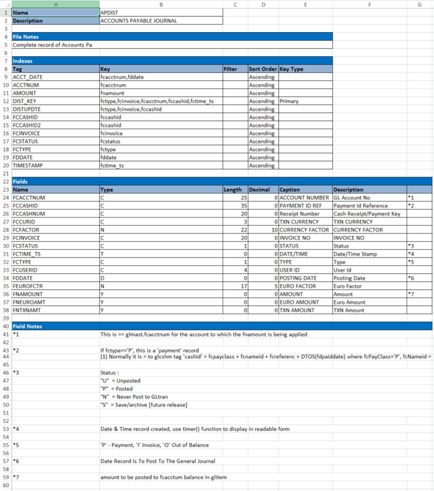

---

title: "Data dictionary entries"
draft: false
type: Article

---

Data dictionary entries follow a common format. A data dictionary entry has four general areas. Here is the **APDIST** table's data dictionary entry, with the areas.

