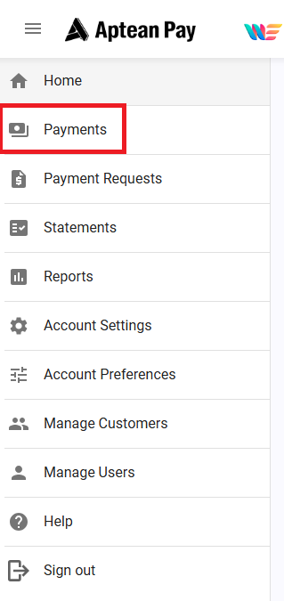

This section will cover how to conduct a refund through Aptean Pay.

To conduct a refund, follow these steps:

1.  Select **Payments** in the **Navigation** Menu.

2.  Select the hyperlink on the Payment ID that you wish to conduct a refund for.

3.  Select **Refund**.

4.  Confirm Refund Amount and Reason
    1.  Either a full refund or partial refund can be selected. If selecting Partial Refund, enter in the amount to be refunded back to payer

