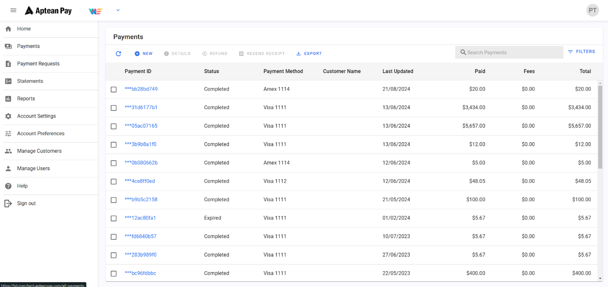
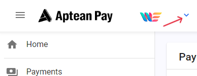
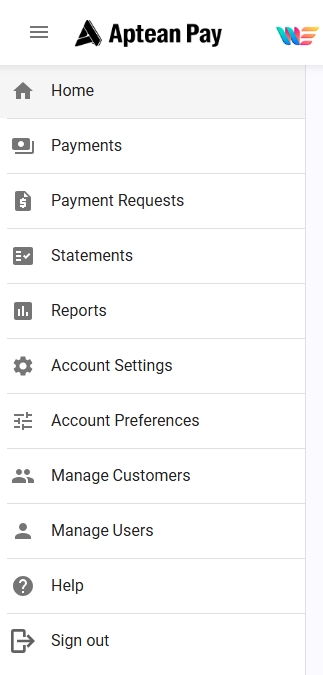
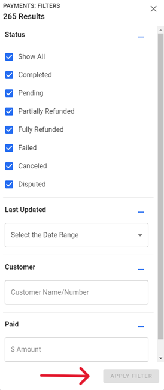

This section provides an overview of your Merchant Portal key functions.

From the home page in the Merchant Portal, you will be able to view all payments, send a payment request, and view Account Settings and preferences from the navigation menu.

See the **Merchant Account** you are currently signed in to and easily switch between Merchants if you are a user of multiple accounts. To switch to another account, select the drop-down arrow and choose the account you wish to view.

The **Navigational Menu** allows you to navigate through all pages within the Merchant Portal. From here, you will be able to view payments, send payment requests, view statements and reports, edit account settings and preferences, and manage customers and users.

Filter Options  
Select **Filters** on the far-right-side of either **Payments** or **Payment Requests** to set your filter criteria. Select or deselect the related filters you wish to apply:

1.  Status
    1.  Last updated date range
        1.  Customer Name/Number (payments only)
        2.  Paid amount or range (payments only)
    2.  Click **Apply Filter** to view filtered transaction list.

