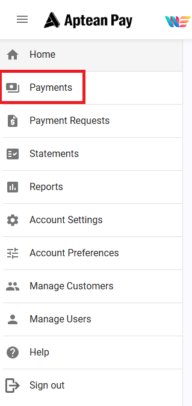
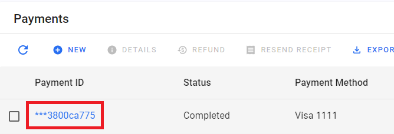
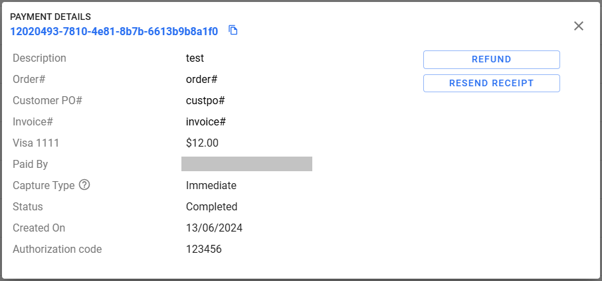
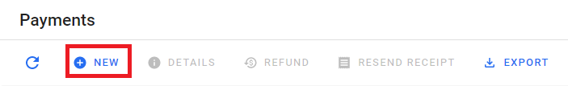
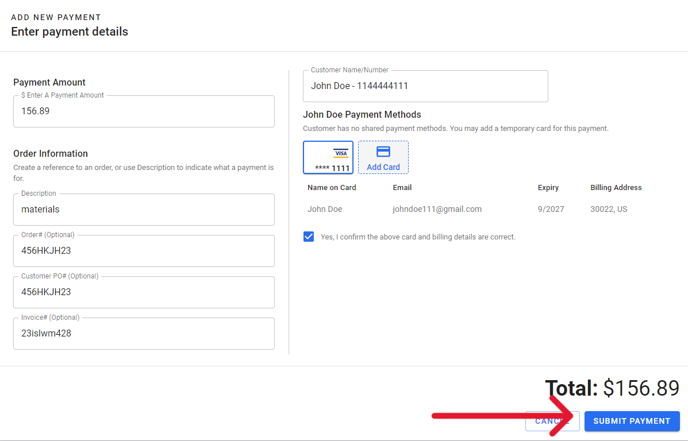
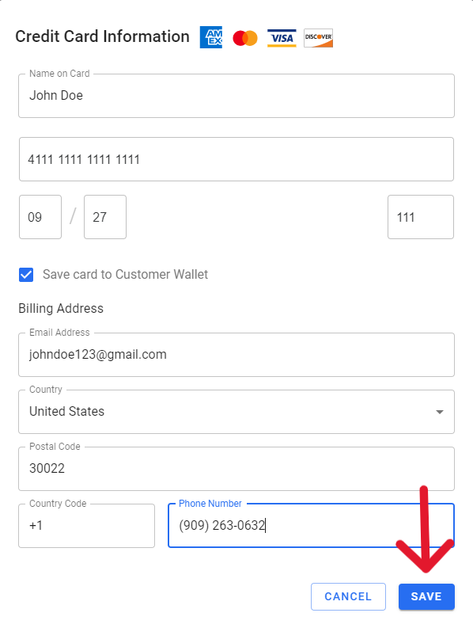

The Payments within the Merchant Portal section provides an overview of your Merchant Portal key functions.

## View Payments

The View Payments section covers how to view a payment through Aptean Pay. To view a payment, follow these steps:

1.  Select **Payments** in the **Navigation** Menu.

2.  Select the hyperlink on the Payment ID that you wish to view.

    

3.  You can now view the payment details.

## Virtual Terminal

1.  For **Virtual Terminal** (immediate capture payment):
    1.  Select **Payments** within the Navigation Menu.

2.  Click the **New** option.

3.  Fill in the appropriate Payment details:
    1.  Enter Customer email or name on card.
        1.  If the customer has been used before and a card has been saved, a saved card will be available to select.
        2.  If no card is associated to email or name, click **Add Card** and enter in the appropriate information, then click **Save**.
        
        >[!Note] The card saved will be available if the name or email associated is selected again for a future transaction.

        3.  Add a description to find this payment again in **Payments**.

4.  When all required fields are completed, click the checkbox to confirm the above card and billing details are correct, then click **Submit Payment**. You can then view the payment status on the **Payments** tab.

    

    1.  Save your billing details for future reference.