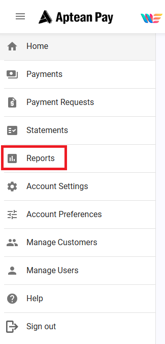
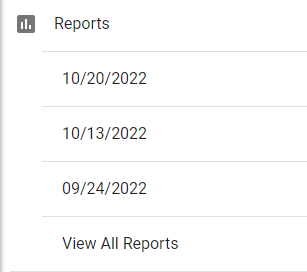
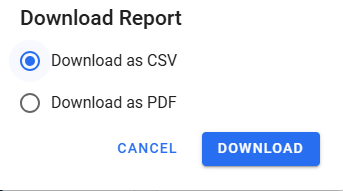
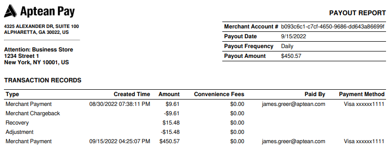

Payout Reports gives you more detailed information pertaining to each payout and transactions occurring within that payout period, including payment method and payee.

1.  Select **Reports** tab within the Navigation Menu

    

2.  Select a payout period to download

    

3.  You can download the report as CSV or PDF files. 

    

>[!Note] The payout frequency is daily and cannot be changed.

