Once a Payment Request has been submitted, the customer will receive an email notification (and SMS message, if the number was included in the Payment Request form).

1.  The customer will conduct the following actions:
    1.  Open email and click **Pay or Download Invoice** link.

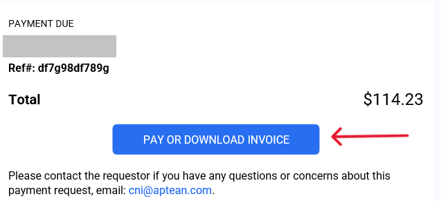

2.  Payer can either checkout as guest (one time payment to invoice) or create a Payer Portal Account (recurring end-customer to Merchant) to pay Payment Request.

>[!Note] To pay via eCheck (ACH), you must have an account.

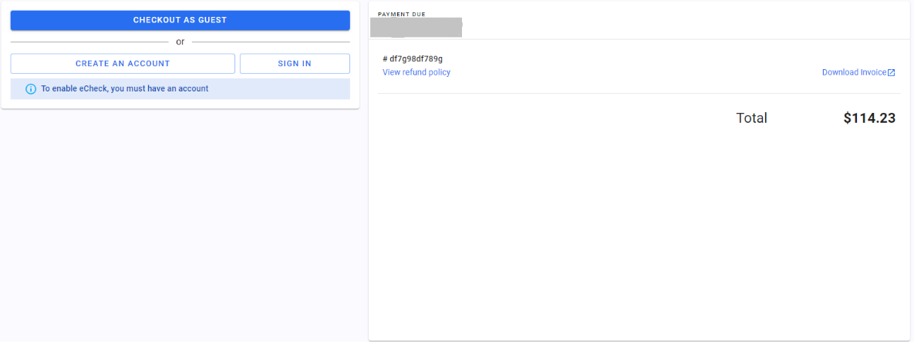

3.  Creating a payer account allows the end-customer to save cards and ACH on file for future payments:
    1.  Click the **Create an Account** and then select **Sign up now**
    2.  Enter an email address and click **Send verification code**. A code will be sent to the customer email address

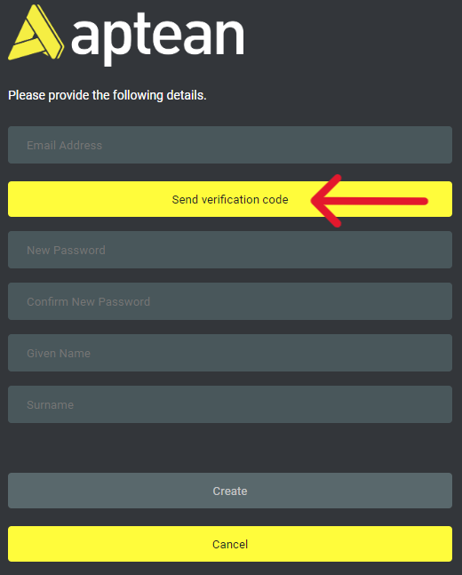

4.  After the code is entered, click **Verify code**.

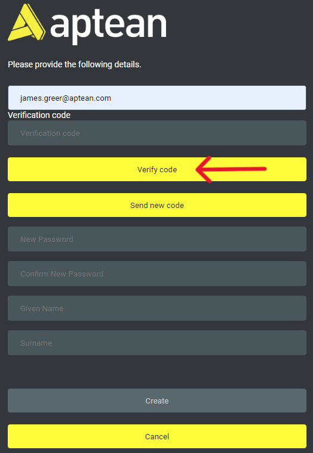

5.  Enter password, Given (First) Name and Surname (Last Name), then click **Create**.  
    The payer account has been created.
6.  In the newly created Payer Portal account, payers can pay outstanding payment requests, which will automatically populate on their account:
    1.  Select the Payment Request to Pay.

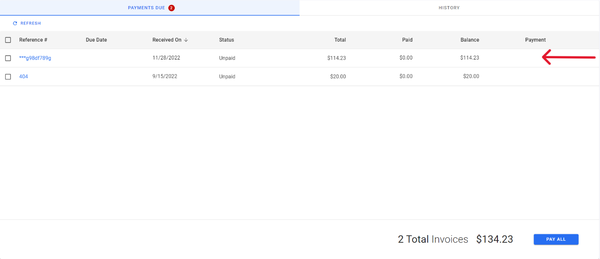

7.  Click **Make Payment**. You can also **Download Invoice** to view the invoice associated to payment request and maintain for your records.

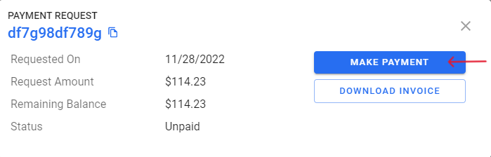

8.  Click **Pay Selected** at bottom right of screen, then either **Submit Payment** by selecting stored card, or enter in new card (follow instructions on screen, select **Save this card to wallet** and click **Save** to reuse this payment method).

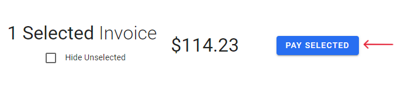

9.  After you have selected a card, click **Submit Payment** in the checkout screen. A payment receipt will be sent to the associated email address of your payer account.

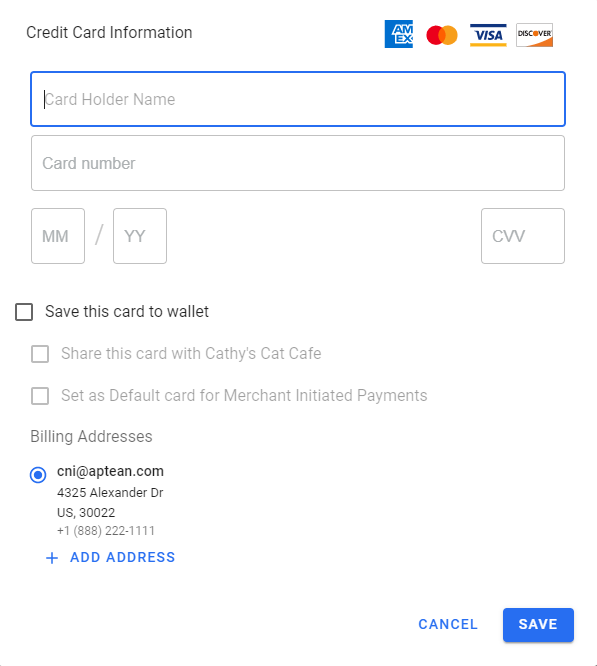

10.  To view the status of a payment, click on the **Reference \#,** where you will find the history of the payment, and downloadable invoice.

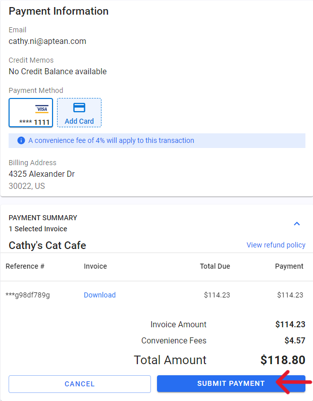

11.  Receiving payment:
    1.  After payment has been made and accepted, the payment request listed in your Merchant Portal will change from *pending* to *complete*.

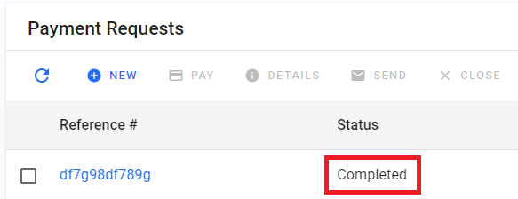

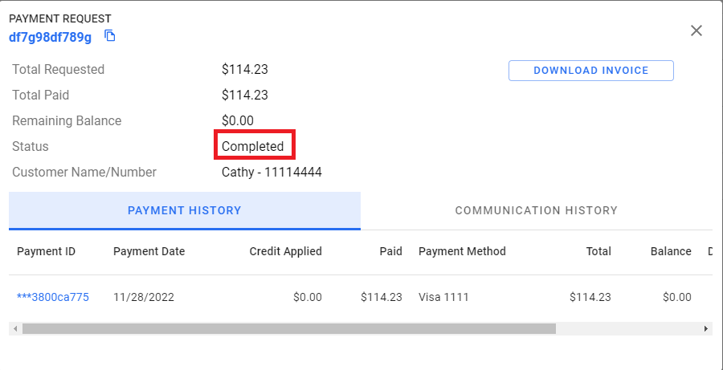