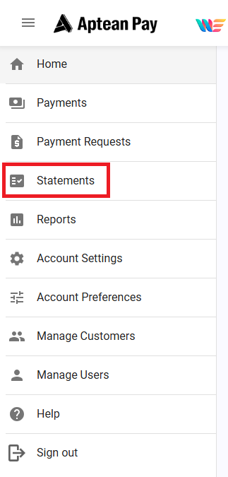
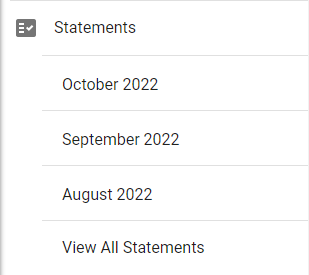
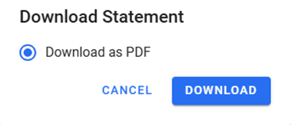

This section will cover how to download and read your monthly Aptean Pay statement, including reconciliation information.

1.  Aptean Pay statements are generated on the 7th calendar day of each month. To download statements, click **Statements** within the Navigation Menu and choose which statement you would like to download. You can download as a PDF file.
    1.  Click **Statements** tab within the Navigation Menu.

    2.  Select a statement to download.

    3.  Choose the format to download.

    4.  Your statement provides information pertaining to all monthly activity in your account.
    5.  Payout summary gives you information of each payout that has occurred based on your selected Payout frequency during account setup.
    6.  Transaction summary gives all transactions that have occurred during the reported period.