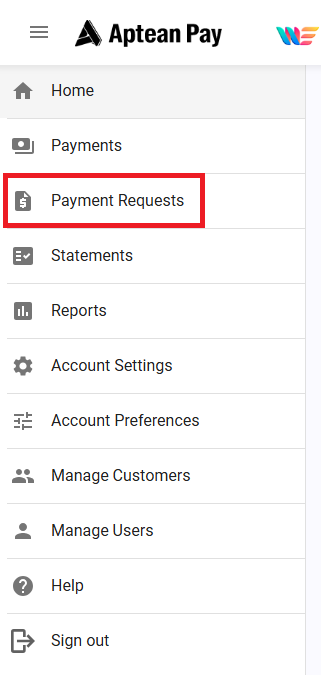
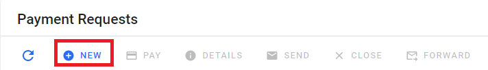
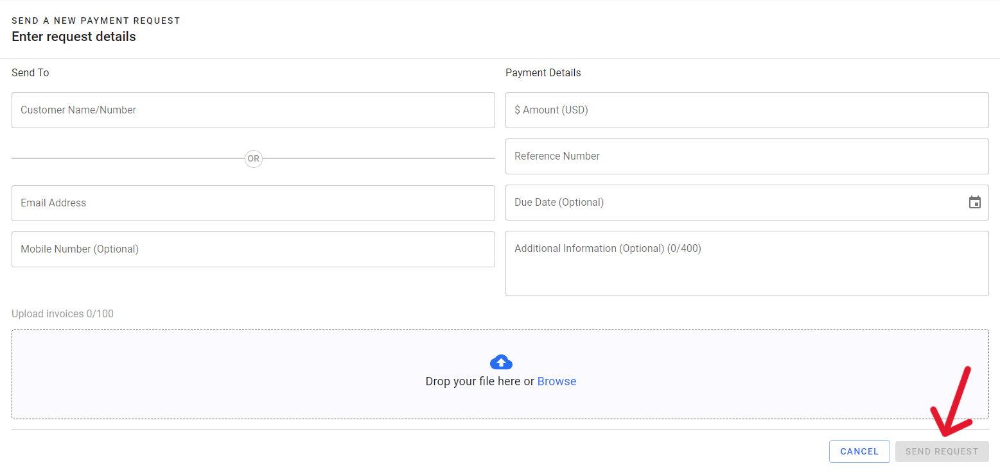

To conduct a payment request, perform these steps.

1.  For **Payment Request** (via email or mobile number):
    1.  Select **Payment Requests** within the Navigation Menu.

1.  Click the **New** option.

1.  Fill in the appropriate information. A reference number is usually tied to the invoice number generated from the ERP, or manually created.
    1.  To process a payment request, a PDF invoice must be attached. You can upload up to 100 files. After a file has been uploaded, click **Send Request**.
    2.  A Payment Request has now been sent to the customer email and the customer can pay this using the link in the email or by logging into the Payer Portal.

